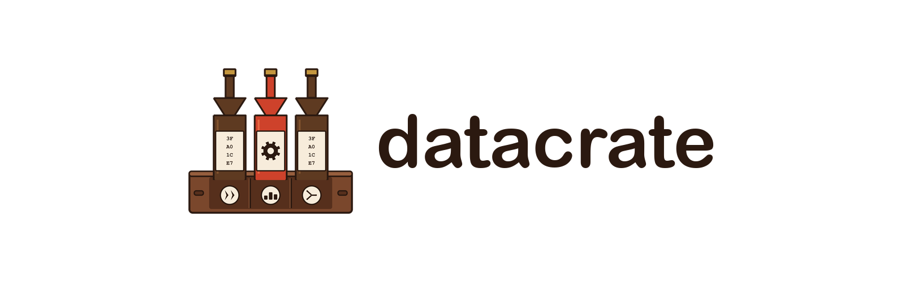

[](https://github.com/com-vitthalmirji/datacrate/actions/workflows/ci.yml)
[](https://github.com/com-vitthalmirji/datacrate/actions/workflows/release-plz.yml)
[](https://github.com/com-vitthalmirji/datacrate/actions/workflows/audit.yml)
[](https://com-vitthalmirji.github.io/datacrate/)
[](https://crates.io/crates/dtl-core)
[](https://www.rust-lang.org)
[](LICENSE)
---

# datacrate

A Rust Cargo workspace for building a typed data pipeline: streaming CSV
tooling, a typestate pipeline builder, and compile-time schema contracts
today, growing toward a fuller Arrow/Parquet/DataFusion pipeline. The goal is
a schema mismatch that fails to compile, not one that fails three hours into
a run.

See [Getting Started](https://com-vitthalmirji.github.io/datacrate/getting-started.html)
for the current crate layout.

## Prerequisites

- [rustup](https://rustup.rs/) — the pinned toolchain in `rust-toolchain.toml`
  (stable, with `rustfmt` and `clippy`) is installed automatically on first
  `cargo` invocation in this directory.
- [`just`](https://github.com/casey/just) — task runner used for all dev
  commands below (`cargo install just` or via your package manager).

## Quick start

```sh
git clone <this-repo>
cd datacrate
just verify   # fmt check, clippy (warnings denied), tests, release build
```

Run the CSV column-selection CLI directly:

```sh
cargo run -p csv-select-cli --bin csv-select -- fixtures/m1/headers.csv --column 1
```

## Development

| Command        | What it does                                              |
|----------------|------------------------------------------------------------|
| `just fmt`     | `cargo fmt --all --check`                                  |
| `just lint`    | `cargo clippy --all-targets --all-features -- -D warnings` |
| `just test`    | `cargo test --all-targets --all-features --locked`         |
| `just release` | `cargo build --release --locked`                            |
| `just verify`  | all of the above, plus `git diff --check`                   |

Run `just verify` before opening a pull request — it is the same check CI runs.

### Git hooks

Enable the repo's pre-commit hook (runs `just verify` before each commit) once per clone:

```sh
git config core.hooksPath .githooks
```

See [`CONTRIBUTING.md`](CONTRIBUTING.md) for commit message conventions,
branching, and the pull request process.

## Documentation

- Guide (published): https://com-vitthalmirji.github.io/datacrate/
- API reference (rustdoc, published): https://com-vitthalmirji.github.io/datacrate/api/
- API reference (also on docs.rs): https://docs.rs/dtl-core
- API reference (local): `cargo doc -p dtl-core --open`
- Guide (local): `cargo install mdbook --locked && mdbook serve book`
