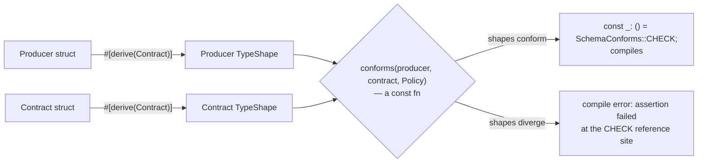

# Compile-time schema contracts

`crates/contracts` (plus its derive macro, `crates/contracts-derive`) checks
whether one struct's shape is compatible with another's — the "producer" and
the "contract" — entirely at compile time. If the shapes don't conform under
the chosen policy, the crate fails to compile with an `assertion failed`
message pointing at the check, not a test failure discovered later.

## The problem this solves

Two parts of a pipeline agree on a schema by convention: a struct produced
by one stage, and a struct expected by the next. Nothing stops them from
drifting apart — a field gets renamed, a type changes from `String` to
`Option<String>` — and the mismatch is usually only caught when real data
flows through and something panics or silently drops a column. This crate
turns that drift into a build failure instead.

## How it works

1. `#[derive(Contract)]` walks a struct's fields and builds a `TypeShape`
   tree describing them — recursing through `Option<T>`, `Vec<T>`, and
   `HashMap`/`BTreeMap<K, V>` so nested optionality is preserved rather than
   flattened (`Vec<Option<T>>` and `Vec<T>` are different shapes, and stay
   different all the way through comparison).
2. `conforms(producer, contract, policy)` is a `const fn` that structurally
   compares two `TypeShape`s under a [`SchemaPolicy`](#policies).
3. `SchemaConforms::<Producer, ContractT, Policy>::CHECK` is a `const` whose
   initializer panics if the shapes don't conform. Referencing it from a
   `const _: () = ...;` item forces the compiler to evaluate that panic
   during compilation — so a schema mismatch becomes a real compile error at
   the reference site.

```rust,ignore
use contracts::{Backward, Contract, SchemaConforms};

#[derive(Contract)]
struct Producer {
    id: i64,
    name: String,
    tags: Vec<Option<String>>,
}

#[derive(Contract)]
struct Contract {
    id: i64,
    name: String,
    note: Option<String>, // missing from Producer, but Optional — allowed under Backward
}

// Fails to compile if Producer no longer conforms to Contract under Backward:
const _: () = SchemaConforms::<Producer, Contract, Backward>::CHECK;
```



The comparison itself is ordinary structural logic; what makes it a contract
is that it runs inside a `const fn` referenced from a `const _: () = ...`
item, forcing the compiler to evaluate — and potentially panic on — it during
compilation, not at any later test run.

## Policies

| Policy | Rule |
|---|---|
| `Exact` | Same fields on both sides, matched by name case-insensitively, in any order, each with an identical shape. No extras either way. |
| `ExactUnorderedCI` | Identical to `Exact` — a distinct name kept for parity with `compile-time-data-contracts`, which exposes both. |
| `ExactOrdered` | Like `Exact`, but fields are matched positionally by index and names compared case-*sensitively*. |
| `ExactOrderedCI` | Like `ExactOrdered`, but names are compared case-insensitively. |
| `ExactByPosition` | Fields matched purely by index; names aren't compared at all, only the shape at each position. |
| `Backward` | Every contract field is satisfied — present (matched by name, case-sensitively) with a matching shape, or absent but `Optional`/`#[contract(default)]`. Producer may carry extra fields. |
| `Forward` | Every producer field exists in the contract (matched by name, case-sensitively) with a matching shape. Contract may have extra fields the producer omits. |
| `Full` | Accepts everything — the check still runs but can never fail. Present for parity with `compile-time-data-contracts`; prefer `Backward`/`Forward`/an `Exact*` variant for anything that should actually enforce shape. |

## Why the lattice has five `Exact*`-shaped variants, not one

`Exact` didn't start out meaning "unordered, case-insensitive." The first
version compared fields positionally, by index, with case-sensitive names —
and that was simply what `Exact` meant, full stop. Once this port was
checked against `compile-time-data-contracts`'s own semantics, `Exact` there
turned out to mean something looser: same fields on both sides, matched by
name, case-insensitively, in any order. Redefining `Exact` to match wasn't a
free choice — it was a breaking change to whatever code already depended on
the strict positional behavior, so that old behavior didn't just disappear:
it was kept, renamed to `ExactOrdered`, alongside two more variants
(`ExactOrderedCI`, `ExactByPosition`) covering the ordering/case-sensitivity
combinations the source library also exposes, and `ExactUnorderedCI` kept as
a distinct name identical to `Exact` purely for naming parity with the
source. Five variants doing overlapping work looks redundant from the
outside; from the inside, each one is a specific ordering/case-sensitivity
combination that used to be silently conflated into a single `Exact`.

`Full` had its own, sharper bug: it was implemented as "must satisfy both
`Backward` and `Forward`" — which made it a strict check that *could* fail,
not the always-passing escape hatch the source library defines it as. It was
corrected to genuinely accept everything. And `Backward`'s "producer may omit
this field" allowance originally only covered fields typed `Optional` in the
contract — `#[contract(default)]` was added as an opt-in field attribute so
a non-`Optional` contract field can also be declared tolerable-if-missing,
without weakening every other policy's guarantees.

## No engine dependency

`contracts` depends only on `contracts-derive`, which depends only on
`syn`/`quote`/`proc-macro2` — no Arrow, no DataFusion, no execution engine
anywhere in either crate. `TypeShape` comes straight from a struct's own
field types, so the same contract check works regardless of what (if
anything) later reads that struct's data.

## Two real bugs a review pass found

The first version of `#[derive(Contract)]` didn't check whether a struct was
generic — a bare type parameter like `T` in `Wrapper<T>` was recorded as
`Primitive("T")`, so `Wrapper<i64>` and `Wrapper<String>` would compare as
identical shapes. That's a false-positive conformance pass — the one failure
mode this crate exists to prevent. The fix rejects generic structs outright
at derive time: `derive_contract` inspects `input.generics.params` up front
and returns a `syn::Error` compile error instead of emitting a misleading
shape, proven by a dedicated `trybuild` case.

Container detection (`Option`/`Vec`/`HashMap`/`BTreeMap`) had a second gap:
it matched only on a type's last path segment name, with no check on how
many generic arguments it actually carried. A field typed as some unrelated
local type that happened to share a name with one of those stdlib containers
— a domain type literally named `Vec`, say — hit an `.expect()` reaching for
a generic argument that didn't exist, panicking the proc macro instead of
producing an ordinary compile error at the field. A proc macro sees syntax,
not resolved types, so it can never fully disambiguate a shadowed name from
the real container — but it can refuse to panic: arity-checked detection now
falls through to the same opaque-primitive path already used for every other
unrecognized type whenever the argument count doesn't match.

## Try it

```sh
cargo test -p contracts -p contracts-derive
```

Includes `trybuild` cases proving an `Exact`-policy mismatch is a genuine
compile error, and a case proving `#[derive(Contract)]` itself is rejected
on generic structs (a bare type parameter has no shape the macro can see).
