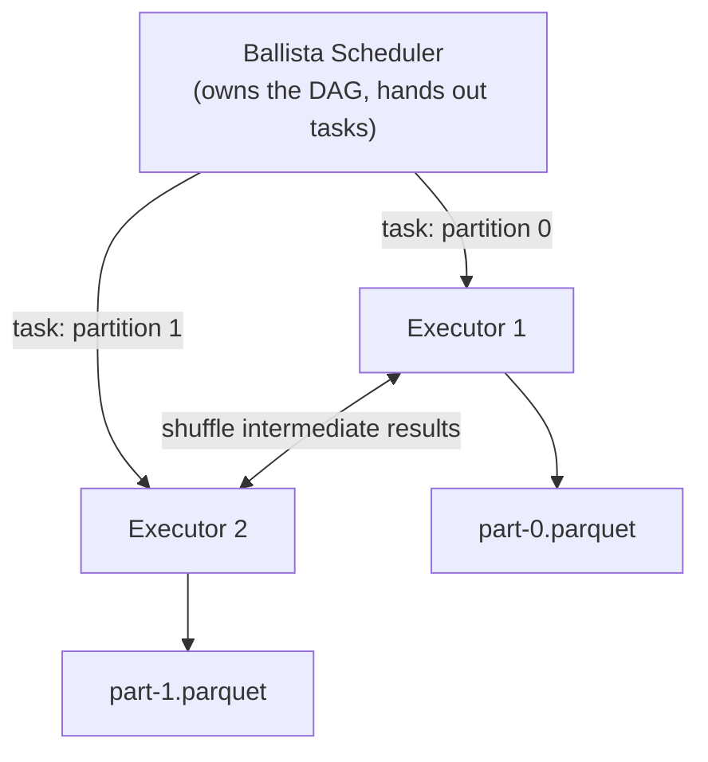
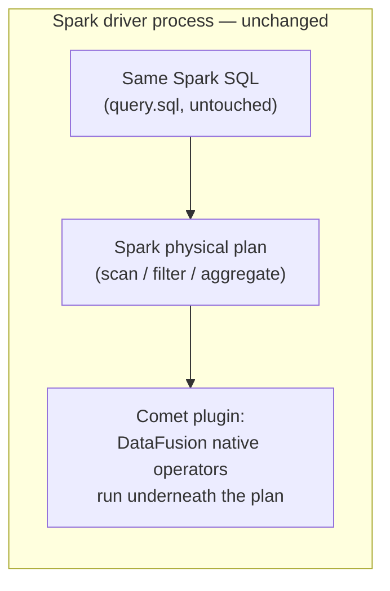

# Beyond one process: distributing DataFusion, and accelerating Spark with it

Everything so far in datacrate runs on one machine, in one process. This
chapter covers the two ways this codebase pushes DataFusion past that
boundary, and — just as important — the one way it deliberately doesn't
compare them to each other.

**The framing, stated once, up front**: every benchmark and proof point here
measures against the same baseline — Apache Spark (JVM/Scala) — and answers
a different question about it:

| Proof point | Question it answers | Role |
|---|---|---|
| DataFusion (single-node) | Can one Rust process replace a single-node Spark job? | Spark *replacement* |
| Ballista | Can DataFusion, partitioned across a cluster, replace *distributed* Spark? | Spark *replacement*, distributed |
| Comet | Can DataFusion's execution engine make an *existing* Spark job faster without leaving Spark? | Spark *accelerant* |

These three never race each other. Ballista's job isn't to beat plain
DataFusion — a distributed system is never faster than a single node at data
small enough to fit on one machine; that's not what it's for. Comet's job
isn't to beat DataFusion standalone — it runs *inside* Spark's own JVM
driver and shuffle service, not instead of it. Each row of that table is its
own comparison against Spark, and the three rows are not comparable to each
other. If you catch yourself putting a Ballista elapsed time next to a Comet
elapsed time and calling one "faster," stop — that's not a comparison either
proof point was designed to answer.

## Ballista: the same query plan, partitioned across a cluster

`crates/pipeline/src/bin/ballista-aggregate.rs` runs the identical
aggregation query datacrate's DataFusion chapter already covers —
`SELECT COUNT(*), SUM(amount) FROM orders WHERE amount > 50.00` — against a
live Ballista cluster instead of a single-node `SessionContext`, specifically
so its result can be diffed against the already-proven single-node value.
Same query, same expected numbers, different execution substrate — Ballista
is not a new query engine, it's the same DataFusion query planner and
execution engine, with the physical plan's stages distributed across a
scheduler and a pool of executors instead of running in one process.

```console
$ just ballista-scheduler       # one terminal
$ just ballista-executor-1      # another terminal
$ just ballista-executor-2      # another terminal
$ cargo run --release -p pipeline --bin ballista-aggregate --features ballista
```

### Why the fixture is two files, not one

```rust
/// Splits `batch` roughly in half and writes each half as its own Parquet
/// file under `dir`, so a table registered over `dir` scans as (at least)
/// two partitions instead of one.
fn write_two_partition_orders(dir: &Path, batch: &RecordBatch) -> Result<(), CliError> {
```

(`ballista-aggregate.rs`, `write_two_partition_orders`)

The module doc comment names the exact failure mode this works around,
sourced from the Ballista Tuning Guide: a table backed by a single file has
exactly one partition and "will not be able to scale even if the cluster has
resource available." One file produces a single-task physical plan that
never leaves one executor — adding a second executor to the cluster buys you
nothing if the scheduler only ever had one task to hand out. Splitting the
fixture into two Parquet files gives the scan two partitions, which gives
the scheduler two tasks to place, which is what actually puts one task on
each registered executor. Distribution isn't automatic just because a
cluster exists — it follows the shape of the data, specifically its
partition count.

**Spark bridge**: this is the exact same constraint as a Spark job reading
one unsplittable file and getting a single-task stage regardless of how many
executors YARN or Kubernetes gave it — `spark.sql.files.maxPartitionBytes`
and coalesce/repartition exist to manage precisely this. Ballista inherits
the constraint because it inherits DataFusion's partition-per-file scan
behavior; the fix is the same shape in both systems, just applied by hand
here instead of via a Spark config knob.



Two Parquet files, two partitions, two tasks — one per executor. A single
file would collapse this to one task on one executor regardless of cluster
size.

### One scheduler, N executors — the topology, not a black box

`justfile`'s `ballista-scheduler`, `ballista-executor-1`, `ballista-executor-2`
recipes (and the further `ballista-executor-3` through `-12` recipes for
larger cluster runs) start real, separate OS processes communicating over
gRPC — a scheduler that accepts the logical plan and assigns tasks, and
executors that each run a share of those tasks and shuffle intermediate
results between each other. Nothing about this is simulated inside a single
process; it's a genuine distributed system, just small enough to run
entirely on one laptop for the purpose of proving the mechanism works.

**Spark bridge**: this is architecturally the same shape as a Spark
driver + a pool of executor JVMs talking over Spark's own RPC layer — a
scheduler that owns the DAG and hands out tasks, executors that run them and
exchange shuffle data. The proof point here isn't "distributed query
execution is a novel idea" — it's "DataFusion's plan and execution engine
can run under that same distributed shape without becoming a different
engine to reason about."

## Comet: DataFusion's engine, running inside Spark itself

Ballista replaces Spark. Comet does the opposite: it leaves an existing
Spark job's driver, scheduler, and shuffle service exactly where they are,
and swaps DataFusion's execution engine in underneath Spark's own physical
plan via `comet-spark-spark4.1_2.13-0.16.0.jar`
(`benchmark/spark-comet/comet-spark-spark4.1_2.13-0.16.0.jar`, loaded as a
Spark plugin). The SQL Spark runs doesn't change:

```sql
-- benchmark/spark-comet/query.sql
CREATE OR REPLACE TEMPORARY VIEW orders
USING parquet
OPTIONS (path '/spark-comet/orders.parquet');

SELECT COUNT(*) AS order_count, SUM(amount) AS total_amount
FROM orders
WHERE amount > 50.00;
```

What changes is which engine actually executes the scan, filter, and
aggregate operators underneath that plan — Comet substitutes DataFusion's
native operators for Spark's JVM ones where it can, inside the same Spark
process. A user running this query sees Spark; the acceleration is invisible
except in wall-clock time.

### One dataset, three ways of running the exact same query

```rust
//! M3.5 Comet benchmark fixture: generates a synthetic `orders`-schema
//! dataset deterministically ... Writes one Parquet file so DataFusion,
//! vanilla Spark, and Spark+Comet all read the exact same bytes.
```

(`crates/pipeline/examples/comet_benchmark_dataset.rs`)

```console
$ cargo run --release --package pipeline --example comet_benchmark_dataset -- \
    --output benchmark/spark-comet/orders.parquet
$ cargo run --release -p pipeline --bin comet-aggregate-datafusion -- \
    --input benchmark/spark-comet/orders.parquet
$ just spark-comet-up
$ # inside the spark container: run benchmark/spark-comet/query.sql
$ #   once against vanilla Spark, once with the Comet plugin enabled
$ just spark-comet-down
```

The dataset generator's comment states the deliberate design directly: one
Parquet file, one set of bytes, read by three different engines, so any
difference in wall-clock time reflects the execution engine and nothing
about the input differing between runs. Amounts cycle `1.00..=100.00` by
`(id % 100) + 1` — a seedless, deterministic pattern — specifically so
`order_count` and `total_amount` are computable independently of which
engine ran the query, giving every leg (DataFusion, vanilla Spark, Spark+Comet)
a correctness check as well as a timing number.

**Scala bridge**: think of Comet the way you'd think of swapping a JVM's
default garbage collector for a different one — the program you wrote, the
Spark SQL you submitted, is completely unchanged; a substitutable component
underneath the interface you already use got faster. That's a fundamentally
different kind of claim than "rewrite your Spark job in Rust," and this
codebase is careful to keep those two claims separate — Comet's benchmark
proves the substitution works and measures its effect against vanilla Spark,
nothing more, nothing about DataFusion-the-standalone-engine's own number
from a different benchmark leg.



The plan Spark builds doesn't change; what changes is which engine executes
the operators underneath it — Comet swaps in, Spark's driver and shuffle
service never leave the picture.

## Why the three never appear side by side as a ranking

Putting Ballista's elapsed time and Comet's elapsed time in one table,
ranked, would imply they're solving the same problem — they aren't. Ballista
answers "should this workload leave the JVM entirely, distributed?" Comet
answers "should this workload stay on Spark, just faster?" Those are
different decisions an engineering team makes for different reasons — data
gravity, operational maturity, existing job complexity, migration cost — and
collapsing them into one leaderboard erases exactly the information that
makes each proof point useful on its own. Every real number behind these
claims is reproducible — toolchain, hardware, seed, and elapsed time are
recorded alongside each measurement — and each one is labeled against its own
specific Spark baseline, not against each other.

## Try it yourself

```sh
just ballista-scheduler & just ballista-executor-1 & just ballista-executor-2 &
cargo run --release -p pipeline --bin ballista-aggregate --features ballista

cargo run --release --package pipeline --example comet_benchmark_dataset -- \
    --output benchmark/spark-comet/orders.parquet
cargo run --release -p pipeline --bin comet-aggregate-datafusion -- \
    --input benchmark/spark-comet/orders.parquet
```

Both proof points are runnable end to end on a single laptop — the cluster
in the Ballista case and the JVM in the Comet case are real, just scoped
small enough that "distributed" and "embedded in Spark" remain honest claims
without needing a real cluster to demonstrate them.
