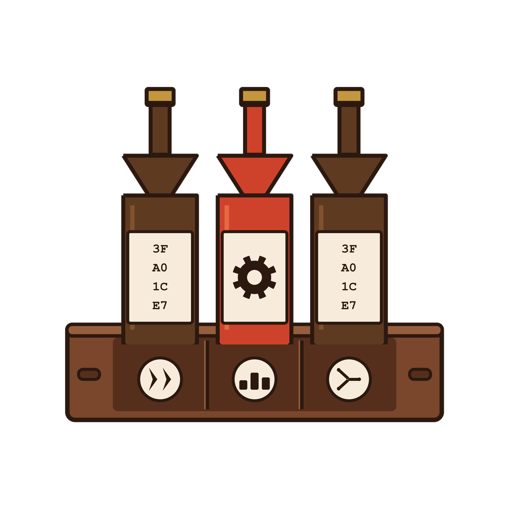

# Getting Started



`datacrate` is a Rust Cargo workspace for building a typed data pipeline:
streaming CSV tooling today, growing toward an Arrow/Parquet/DataFusion
pipeline and typestate-based builder APIs.

## Prerequisites

- [rustup](https://rustup.rs/) — the pinned toolchain in `rust-toolchain.toml`
  (stable, with `rustfmt` and `clippy`) is installed automatically on first
  `cargo` invocation in this directory.
- [`just`](https://github.com/casey/just) — task runner used for all dev
  commands (`cargo install just` or via your package manager).

## Workspace layout

```
crates/
├── dtl-core/     lib   — ownership/borrowing/slices fundamentals, zero-copy CSV batching
├── csv-cli/      bin   — streaming CSV column-selection CLI (csv-select)
├── pipeline/     lib   — Arrow/Parquet/DataFusion pipeline (in progress)
├── typestate/    lib   — typestate builder patterns (in progress)
└── rusty-ready/  lib   — DSA-in-Rust practice, isolated from the other crates
fixtures/         deterministic test data, committed
exercises/        ownership/compiler exercises
```

## Quick start

```sh
git clone <this-repo>
cd datacrate
just verify   # fmt check, clippy (warnings denied), tests, release build
```

Run the CSV column-selection CLI directly:

```sh
cargo run -p csv-select-cli --bin csv-select -- fixtures/m1/headers.csv --column 1
```

Continue to [Usage](usage.md) for a walkthrough of `csv-select` and the
`dtl-core` library.
