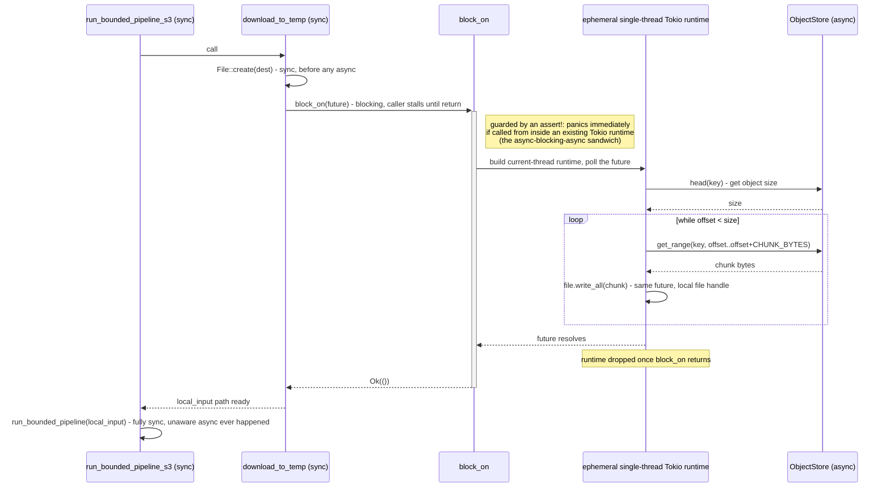

# The object-store edge: bridging sync and async without a sandwich

`crates/pipeline/src/object_store_io.rs` is the one place in this codebase
where `async` exists at all. Every other pipeline stage is synchronous by
design; this module's whole job is to let a synchronous pipeline read from
and write to S3 (or a MinIO-compatible bucket) without dragging `async` into
the rest of the call stack. Read it alongside `crates/pipeline/src/bin/run-s3-pipeline.rs`
(the CLI that drives it end to end) and `docker-compose.minio.yml` (the local
stand-in for S3). If you're coming from Scala/Spark, the interesting bridge
here isn't cloud storage - it's what happens when a language *without* a
green-thread runtime baked into every function call has to talk to a library
that only offers `async fn`.

## Why this module exists instead of `async` spreading everywhere

`object_store::ObjectStore`'s trait methods are all `async fn` - there's no
synchronous variant to call instead. The rest of the pipeline
(`run_bounded_pipeline`, the CSV reader, the Parquet writer) is deliberately
synchronous: no `Tokio`, no `.await`, ordinary blocking I/O. `object_store_io.rs`'s
job is to be the seam between those two worlds without forcing the sync side
to become async.

```rust
fn block_on<F: std::future::Future>(future: F) -> F::Output {
    assert!(
        tokio::runtime::Handle::try_current().is_err(),
        "object_store_io::block_on called from inside an existing Tokio \
         runtime - this is the async-blocking-async sandwich and would \
         panic or deadlock. Once a caller runs inside async code, replace \
         this call with tokio::task::spawn_blocking instead."
    );
    tokio::runtime::Builder::new_current_thread()
        .enable_all()
        .build()
        .expect("current-thread tokio runtime should build")
        .block_on(future)
}
```

(`object_store_io.rs:33`)

Each call to `download_to_temp` or `upload_from_temp` spins up its own
short-lived, single-threaded Tokio runtime, drives exactly the async work it
needs on it, and lets it drop. No async runtime persists across calls into
this module, and nothing outside this module ever needs to know Tokio
exists.

**Scala/Spark bridge**: this is a deliberate rejection of the shape Cats
Effect or ZIO nudges you toward - one runtime constructed at the top of
`main` and threaded everywhere. That shape is the right one when *most* of
your program is effectful. Here, almost none of it is: one CSV reader, one
Parquet writer, one channel between two threads, all synchronous, with a
single narrow edge that happens to need async because the S3 SDK demands it.
Building a runtime per call is more expensive than a shared one, but the
alternative - infecting `run_bounded_pipeline` and everything it calls with
`async fn` and `.await` - would cost far more in complexity for zero benefit
to the 95% of the pipeline that never touches the network.



Nothing above `block_on` ever holds a `.await` - the runtime is built, used for
exactly one call, and dropped before control returns to synchronous code.

## The assertion that turns a silent deadlock into a named panic

The dangerous failure mode this module guards against is calling
`block_on` from code that is *already* running inside a Tokio runtime - the
"async-blocking-async sandwich" Tokio's own docs warn about. A
single-threaded runtime blocking inside another runtime's worker thread can
deadlock or panic deep inside Tokio's internals, at a call site with no
obvious connection to `object_store_io.rs`.

```console
$ cargo test -p pipeline block_on_from_inside_a_running_runtime_panics_immediately -- --nocapture
```

The test (`object_store_io.rs:212`) is itself an `#[tokio::test]` - already
running inside a runtime - and calls `download_to_temp` from within it,
asserting the resulting panic message contains `"async-blocking-async
sandwich"`. The `assert!` at the top of `block_on` (`object_store_io.rs:34`)
is what turns "mysterious internal Tokio panic three frames down" into "a
named, first-frame panic that tells you exactly what invariant you broke and
what to do about it." The actual fix for when this module *is* reached from
async code is to swap `block_on` for `tokio::task::spawn_blocking` - not to
delete the assertion.

**Scala bridge**: this is the same category of bug as blocking a Cats
Effect / ZIO fiber's worker thread with a synchronous call that itself blocks
on that same runtime - `IO.blocking` / `ZIO.attemptBlocking` exist precisely
to move such work off the shared worker pool. The assertion here is a
compile-time-adjacent guard turned into a fail-fast runtime check for a
constraint Rust's type system doesn't encode on its own: nothing in
`block_on`'s signature stops you from calling it from async code, so the
module defends the invariant explicitly instead of hoping callers remember
it.

## Streaming both directions keeps peak memory flat

```rust
const CHUNK_BYTES: usize = 8 * 1024 * 1024;
```

(`object_store_io.rs:31`)

`download_to_temp` (`object_store_io.rs:77`) doesn't call `store.get(key)`
and write the whole object to disk in one shot - it reads the object's size
via `store.head(key)`, then walks it in `CHUNK_BYTES`-sized `get_range`
calls, writing each chunk to the destination file as it arrives.
`upload_from_temp` (`object_store_io.rs:120`) is the mirror: it reads the
local file in `CHUNK_BYTES` chunks and feeds each one to a
`WriteMultipart` upload, never holding more than one chunk plus the
in-flight multipart state in memory. This matters concretely: a whole-file
`get`/`bytes()` implementation measures peak RSS scaling linearly with input
size - the chunked version doesn't, because it never materializes more than
one 8 MiB window at a time regardless of whether the object is 10 MB or
10 GB.

`CHUNK_BYTES` is chosen deliberately, not arbitrarily: 8 MiB sits comfortably
above `object_store`'s 5 MiB multipart-part minimum, so uploads don't pay a
part-per-tiny-chunk penalty, while staying small enough that peak memory
tracks this one constant instead of the file size.

**Scala/Spark bridge**: this is the same shape as Spark reading a file in
partition-sized blocks rather than collecting it to the driver - the size of
the whole object is irrelevant to memory pressure as long as you never hold
more than one window of it at a time. The difference is that Spark makes
this the default behavior of `spark.read`, invisible to the caller; here,
`CHUNK_BYTES` and the `while offset < size` loop are visible, hand-written,
and exactly as large as they need to be for this specific edge.

## Errors name which side failed, not just that something did

```rust
enum DownloadStepError {
    Store(object_store::Error),
    Io(std::io::Error),
}
```

(`object_store_io.rs:48`)

Inside the `block_on` block, both the object-store call (`get_range`) and
the local file write (`write_all`) can fail, and `?` needs a single error
type to converge on. `DownloadStepError` exists solely to make that
convergence type-checkable - then `download_to_temp`'s outer `.map_err`
(`object_store_io.rs:98`) immediately splits it back apart into the crate's
real error type, `PipelineIoError::DownloadObject` for a store failure,
`PipelineIoError::OpenOutput` for a local I/O failure. A caller matching on
the returned `PipelineIoError` sees exactly which side broke; nothing about
`DownloadStepError` ever leaks past this function.

```console
$ cargo test -p pipeline download_of_a_missing_key_reports_download_object_not_a_panic -- --nocapture
```

The test (`object_store_io.rs:200`) asserts a missing key produces
`Err(PipelineIoError::DownloadObject { .. })`, not a panic - the boring but
load-bearing guarantee that a network/store failure is just data flowing
through `Result`, indistinguishable in kind from any other error this crate
returns.

**Scala bridge**: `DownloadStepError` is the Rust equivalent of a small
local sealed trait scoped to one method body, used purely so a for-comprehension
or `.flatMap` chain has one error type to converge errors from two different
sources on - then translated back to the real domain error ADT the instant
the method returns. The scoping is the point: it would be a mistake to
promote `DownloadStepError` to a crate-wide type, the same way it would be a
mistake to let a method-local error ADT escape its method in Scala.

## Round-tripping through an in-memory store, not a real bucket

```console
$ cargo test -p pipeline round_trips_bytes_through_the_store_and_a_local_temp_file -- --nocapture
```

(`object_store_io.rs:173`)

The test seeds an `object_store::memory::InMemory` store, downloads through
`download_to_temp`, re-uploads through `upload_from_temp`, and asserts the
bytes match byte-for-byte. `InMemory` implements the exact same
`ObjectStore` trait `AmazonS3Builder::from_env()` produces in
`run-s3-pipeline.rs` - so this test exercises the real chunking, error
handling, and `block_on` logic in this module without a network call or a
running MinIO container anywhere in the test process. Nothing about
`download_to_temp` or `upload_from_temp` is aware it's talking to memory
instead of S3; that's the entire value of coding to the `ObjectStore` trait
object (`&dyn ObjectStore`) instead of a concrete `AmazonS3` type.

## The CLI adds nothing this module didn't already decide

```rust
let store = AmazonS3Builder::from_env()
    .with_bucket_name(&args.bucket)
    .build()
    .map_err(|source| CliError::BuildStore { source })?;
```

(`run-s3-pipeline.rs:84`)

`run-s3-pipeline` is deliberately thin. `AmazonS3Builder::from_env()` reads
the standard AWS environment variables - `AWS_ACCESS_KEY_ID`,
`AWS_SECRET_ACCESS_KEY`, `AWS_ENDPOINT_URL`, `AWS_REGION`, `AWS_ALLOW_HTTP` -
which is what lets the exact same binary point at real S3 or at a local
MinIO container with no code path forking on which one it's talking to: only
the environment differs.

```console
$ docker compose -f docker-compose.minio.yml up -d
$ export AWS_ACCESS_KEY_ID=minioadmin
$ export AWS_SECRET_ACCESS_KEY=minioadmin
$ export AWS_ENDPOINT_URL=http://localhost:9000
$ export AWS_REGION=us-east-1
$ export AWS_ALLOW_HTTP=true
$ cargo run --bin run-s3-pipeline -- \
    --bucket demo \
    --input-key input.csv \
    --output-key output.parquet
wrote N batch(es), M row(s) to s3://demo/output.parquet
```

The CLI's only real job (`run-s3-pipeline.rs:95`) is calling
`run_bounded_pipeline_s3` (`bounded.rs:323`) and translating its
`Result` into an exit code - everything about chunked streaming, the
sync/async boundary, and error translation already happened inside
`object_store_io.rs`, not here.

## `run_bounded_pipeline_s3` doesn't rewrite the pipeline for S3

```rust
pub fn run_bounded_pipeline_s3(
    store: &dyn ObjectStore,
    input_key: &ObjectPath,
    output_key: &ObjectPath,
    config: &PipelineConfig,
    cancel: &CancellationToken,
) -> Result<PipelineReport, PipelineError> {
    let staging_dir = tempfile::tempdir()...;
    let local_input = staging_dir.path().join("input.csv");
    let local_output = staging_dir.path().join("output.parquet");

    download_to_temp(store, input_key, &local_input)?;
    let report = run_bounded_pipeline(&local_input, &local_output, config, cancel)?;
    upload_from_temp(store, &local_output, output_key)?;

    Ok(report)
}
```

(`bounded.rs:323`)

This is the whole point made concrete: `run_bounded_pipeline_s3` is
download, then call the *unmodified* local `run_bounded_pipeline`, then
upload. It doesn't know about batching, cancellation checks, staged writes,
or partial-output safety - all of that already exists in
`run_bounded_pipeline` and is reused verbatim. The doc comment on this
function names the deliberate consequence directly: "local disk staging
keeps the bounded pipeline's memory envelope unchanged from the local-file
case - only the two ends of the pipe move." The same cancellation and
staged-write guarantees datacrate's DataFusion chapter demonstrates for the
local pipeline apply here unchanged, because it's the same function running
underneath, not a parallel S3-flavored reimplementation.

**Scala/Spark bridge**: this is the shape of writing one Spark job against
`DataFrameReader`/`DataFrameWriter` and letting the `s3a://` vs `file://`
scheme in the path decide which filesystem implementation actually runs -
except here that boundary is drawn by hand, one small function, instead of
being an abstraction the framework provides for you. `ObjectStore`, in that
sense, is `object_store`'s version of Hadoop's `FileSystem` trait: one
interface, multiple backends, and application code that never needs to know
which one it's talking to.

## Atomic isn't durable: fsync before the rename

The staged-write-then-rename pattern above (write to `.tmp`, rename into
place) guarantees a reader never observes a half-written file - that's
atomicity. It does not by itself guarantee durability: a crash right after
the rename "succeeds" can still lose bytes that were buffered in the OS page
cache but never flushed, or lose the directory-entry update the rename
itself made, depending on filesystem behavior. Those are two different
promises, and the local pipeline `run_bounded_pipeline_s3` reuses unchanged
(see above) makes both of them explicit rather than assuming rename implies
fsync.

The fix is two `fsync` calls, not one. First, the Parquet writer is closed
through the path that hands back its underlying file handle - not the
convenience method that drops it - so `sync_all()` can flush all buffered
data, including the Parquet footer, before the rename happens. Second,
immediately after the rename, the output's *parent directory* is opened and
`sync_all()`'d too - that second fsync is what makes the rename's own
directory-entry update durable, not just atomic-looking. Skipping it would
leave a window where the file's bytes are safely on disk but the directory
still doesn't reliably point at them after a crash.

**Scala/Spark bridge**: this is the same distinction Spark's
`FileOutputCommitter` draws between writing task output to a staging path
and the final commit that makes it visible - "visible" and "durable" are
different guarantees, and a committer that only handles the rename without
forcing the underlying writes to disk has the identical gap this pipeline
closes by hand.

## The completion manifest: proof of what was written, not just that something was

`run_bounded_pipeline_s3` publishes one more object after the Parquet output
lands: a `.manifest.json` sibling of the output key
(`CompletionManifest::key_for`, `manifest.rs:128`), written through the same
staging-then-rename step as the output itself. Before this existed, a caller
polling the bucket after a run had no way to confirm *what* had been
written - row count, or whether the output's content actually matched a
known-good input - without re-downloading and re-parsing the Parquet file.
The manifest is proof, delivered alongside the data, so a caller can check
it cheaply instead.

The manifest carries a snapshot of the input object (key, size, ETag,
last-modified) plus the output's row count and a content digest. The digest
is the interesting part: it has to answer "does this output's *content*
match what I expect" without caring about row order or which batch a row
landed in, since the bounded pipeline streams output in chunks and nothing
about that chunking should leak into what "the same data" means. So each
row is hashed individually with a fixed-seed `ahash::RandomState` - fixed,
because `ahash`'s normal per-process-random seeding is built to resist
hash-flooding attacks against hash maps, which is exactly wrong for a
fingerprint that must be reproducible across runs of identical content - and
the per-row hashes are combined with wrapping `u64` addition, not XOR.
XOR was the obvious first choice and the wrong one: `x ^ x == 0`, so a run
that silently dropped one of two duplicate rows would XOR-hash identically
to the correct run. Wrapping addition doesn't cancel like that
(`accumulate_batch_digest`, `manifest.rs:57`, and the
`duplicate_rows_do_not_cancel_out` test that pins this down,
`manifest.rs:188`). The whole computation runs one row at a time, so the
digest never buffers more than a single row's hash regardless of how large
the output is - it doesn't reopen the memory-envelope question the bounded
pipeline already answered for the rest of this path.

Worth naming what the digest is not: it's a content-drift fingerprint
(dropped, duplicated, or reordered rows), not a security boundary. It
doesn't detect adversarial tampering, and it isn't trying to.

## Try it yourself

```sh
cargo test -p pipeline object_store_io::
docker compose -f docker-compose.minio.yml up -d
cargo run --bin run-s3-pipeline -- --bucket demo --input-key input.csv --output-key output.parquet
docker compose -f docker-compose.minio.yml down
```

The in-memory tests prove the logic; the MinIO round trip proves the wiring.
Both are worth running - they check different things, and neither one
substitutes for the other.
