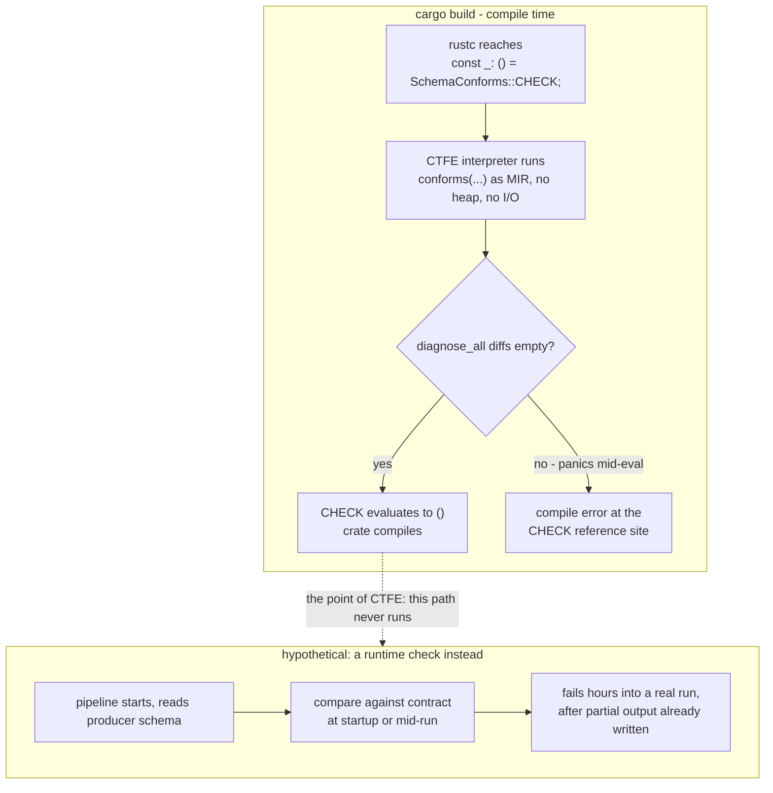
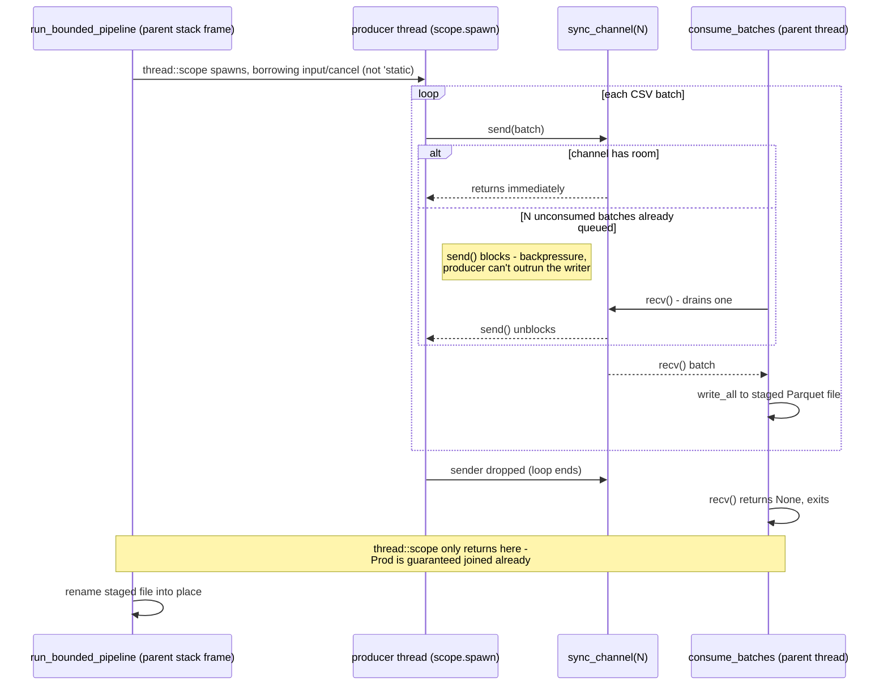

# Rust internals: how dispatch, generics, and closures actually compile

[Rust fundamentals](rust-fundamentals.md) gave you the words - what a trait,
a closure, an `Iterator` *is*. This chapter answers a different question:
when you write `.map(...)`, or put something behind `dyn Trait`, what does
the compiler actually build, and why does it build that instead of what
your JVM/Python/Go instincts expect? If you're fine treating `.map()` as
"same as everywhere else" and never need to know why a binary is big, why
something got inlined, or why a trait refuses to compile as `dyn`, skip
straight to [Usage](usage.md) - nothing later in the book needs this
chapter.

One lens shows up in every section below, borrowed from Eric Normand's
*Grokking Simplicity*: split code into **actions** (their result changes
depending on when or how often you run them - a network call, a clock read,
anything with a side effect), **calculations** (same input, same output,
every time, no matter when you call them or how often - plain computation),
and **data** (facts you record and pass around; data doesn't run, it just
sits there until something reads it). Most of what makes Rust feel
different from Scala is that the compiler *enforces* this split in places
Scala leaves to convention - ownership decides when a value's cleanup
(an action) happens instead of a GC guessing later; a `Result` is data you
must look at, not a thrown exception silently skipping past you;
`Send`/`Sync` turn "is this safe to touch from two threads" from a runtime
gamble into a fact the compiler checks before your program is allowed to
build. Watch for this split called out by name as each mechanism comes up.

Three comparison languages recur below, because they cover the three real
strategies a compiled or JIT'd language can pick for generic code: **Scala/
JVM** (type erasure, plus a JIT that can swap in a direct call at runtime
once it's seen enough), **Go** (a middle ground - shared code bodies plus a
lookup table handed in at runtime), and **Python** (nothing is nailed down
until the call happens - CPython looks up every method by name, every
single time). Rust's answer - one compiled copy per concrete type, calls
resolved at compile time by default - is the fourth point on that map, and
it's easier to place once you've seen the other three.

## Fast path: the concept map

Same idea as [Coming from Spark/Scala](spark-concept-map.md), one level
deeper - not "what's the equivalent API," but "what's the equivalent
*mechanism*." Skim this table first; each row links to the section that
earns it.

| You know this from Scala/FP | The Rust mechanism | Where it shows up in `datacrate` |
|---|---|---|
| The GC frees whatever's unreachable, whenever it gets around to it | Ownership: one owner, freed the instant it goes out of scope - no collector | [Ownership, borrowing, and lifetimes](#ownership-borrowing-and-lifetimes-how-the-checker-actually-works) |
| The JVM picks virtual-vs-inlined per call site, at runtime | You pick static (`<T: Trait>`) vs. dynamic (`dyn Trait`) dispatch, at compile time, in the source | [Static dispatch is the default](#static-dispatch-is-the-default-dyn-is-the-opt-in) |
| Generics erased to `Object` at the bytecode level | Generics **monomorphized** - one compiled body per concrete type | [Monomorphization](#monomorphization-what-static-dispatch-by-default-costs-you) |
| `Function1`, always a heap object, always virtually dispatched | A closure is an anonymous struct; heap + `dyn` only if you ask for it | [Closures are anonymous structs](#closures-are-anonymous-structs-not-references-to-code) |
| `List.map` is eager; `Iterator`/`.view` is the opt-in lazy path | `.map()` is *always* the lazy, fusible path - there's no eager default to opt out of | [Iterators](#iterators-adapters-build-a-pipeline-nothing-runs-until-you-drive-it) |
| Scala implicits / typeclass instance resolution, and the coherence rules around orphan instances; an abstract type member vs. a type-parameterized trait; Scala 3 `given` priority as a specialization stand-in | The trait system's coherence check (the "orphan rule"); associated types vs. generic parameters; no stable specialization | [The trait system](#the-trait-system-coherence-associated-types-specialization-and-hrtbs) |
| A `case class`'s JVM object layout - one header word, fields in declaration order, `Option[T]` always boxes; a `sealed trait`'s subtype each boxed separately | No object header; field order isn't guaranteed; `Option<T>` is often the *same size* as `T` via niche optimization; an `enum`'s size is its largest variant, `Drop` runs recursively field-by-field | [Memory layout](#memory-layout-what-a-struct-or-enum-actually-looks-like-in-ram) |
| `@volatile`, `AtomicReference`, or reasoning about the JMM's happens-before; `synchronized`/`ReentrantLock` guarding a critical section beside the data | `Send`/`Sync` - two auto-derived marker traits that make "is this thread-safe" a compile error, not a runtime race; explicit `Ordering` on every atomic op; `Mutex<T>` wraps the data itself | [Send/Sync, atomics, and Mutex](#sendsync-atomics-and-mutex-concurrencys-compile-time-and-runtime-halves) |
| A `Future`/ZIO fiber the runtime schedules for you, opaquely | `async fn` compiles to a plain enum state machine *you* could (almost) have written by hand | [Async/await](#asyncawait-your-function-became-an-enum) |
| Nothing - the JVM's memory model is guaranteed sound, full stop | `unsafe` opts out of that guarantee for a specific, named set of operations - and Rust has its own formal model (Miri) for catching it when you get it wrong | [Unsafe and the aliasing model](#unsafe-rust-and-the-aliasing-model-what-people-mean-when-they-say-ub) |
| `Either[E, A]` + a `for`-comprehension short-circuiting on the first `Left` | `Result<T, E>` + the `?` operator - the same short-circuit, desugared to explicit `From`-based conversion, not monadic bind | [Error handling](#error-handling-what-really-desugars-to) |
| Shapeless/Magnolia deriving an `Encoder[T]` by walking a case class's fields, at compile time, via implicit search | `const fn` runs your own code - not a derivation macro's - as a restricted interpreter *during compilation*; a `PhantomData<T>` field ties a generic parameter to a struct without storing a `T` at all | [Const evaluation (CTFE)](#const-evaluation-ctfe-what-const-fn-actually-runs-on) |
| `scalac`'s parser → typer → desugaring phases → GenBCode; Zinc's incremental recompilation | AST → HIR → MIR → LLVM IR → machine code; `rustc`'s demand-driven query graph (also what powers `rust-analyzer`); codegen-units/LTO | [The compiler pipeline](#the-compiler-pipeline-what-cargo-build-actually-does) |
| `Future`/`ExecutionContext`, or an actor mailbox, for handing work to another thread | `std::thread::scope` lets a spawned thread borrow stack data that isn't `'static`; `mpsc::sync_channel` gives you a bounded, backpressuring queue between threads | [Scoped threads and channels](#scoped-threads-and-channels-bounded-backpressure-without-async) |
| GC pause tuning, `-Xmx`/`-Xms`, generational promotion; `ArrayList`/`ArrayBuffer`'s doubling growth | No collector to tune - ownership decides free points at compile time; `Vec<T>` uses the same amortized-doubling growth strategy, swappable global allocator | [Allocation](#allocation-what-the-heap-means-without-a-gc) |
| `scala.reflect` macros / Scalameta, mostly avoided in application code | `#[derive(...)]` proc macros - ordinary in application code; `macro_rules!` hygiene (closer to C's preprocessor than anything in Scala) | [Macros](#macros-declarative-hygiene-and-what-derivecontract-generates) |

## Ownership, borrowing, and lifetimes: how the checker actually works

[Ownership and streaming](ownership.md) teaches the *rules* - one owner,
a borrow can't outlive the thing it points at, `&mut` means nobody else gets
a look-in at the same time. This section answers the question a Scala
engineer asks once the rules feel routine: what is the compiler actually
working out when it accepts or rejects a borrow?

Put in Grokking Simplicity terms: a value going out of scope and getting
freed is an **action** - it happens at one specific moment, and *when* it
happens matters (free it too early and you'd have a dangling pointer; free
it too late and you're wasting memory). The borrow checker's whole job is
figuring out, at compile time, the exact window during which that action is
still safe to delay - a **calculation** it runs once over your code, so
nothing has to guess about it at runtime the way a garbage collector does.

**Non-lexical lifetimes (NLL), in plain terms.** Before Rust 2018, a
borrow's "lifetime" ran to the end of its enclosing `{ }` block, whether or
not you actually still used it after that point. That rejected code that
was obviously fine to a human reader (`let r = &mut v[0]; use(r); let r2 =
&mut v[1];` used to fail, because `r`'s borrow "lasted" until the block
ended even though nothing touched `r` again). NLL fixed this by changing
what the checker actually measures: instead of "which block are we
in," it now asks "what is the last line that actually uses this borrow,
following the real path the code takes" - not the source-level brace
nesting. That's why so many patterns that felt like fighting the borrow
checker in early Rust (pre-2018 tutorials, old StackOverflow answers) just
compile today without any change to how you write the code.

**MIR-based borrow checking, in plain terms.** NLL is possible at all
because the borrow checker doesn't look at your code's syntax tree - it
looks at **MIR** (Mid-level IR), a simplified, step-by-step version of your
function broken into small blocks ("do this, then this, then jump here").
MIR is what turns "is this borrow still needed at this point" into a
question the compiler can answer by tracing a graph, the same way you'd
trace which lines of code a debugger could reach - not a guess based on how
the source text is indented. The same MIR is later handed off to LLVM to
turn into machine code, so it does double duty: proving your borrows are
safe, and feeding the step that makes the program fast.

**Polonius, in plain terms.** NLL's approach still says no to a few patterns
that are genuinely safe - the textbook case is a function that sometimes
returns a `&mut` borrow from inside a loop, and wants to create a fresh
borrow only on the branch where it didn't return one. The next-generation
checker, **Polonius**, restates the whole analysis as a set of logic rules
(the same style a Prolog or Datalog query engine uses) run over MIR, instead
of one hand-written pass - precise enough to say yes to that case. Today
it's an opt-in, nightly-only alternative (`-Zpolonius`), not what you get by
default; if you ever hit a borrow error that looks obviously wrong to you,
this is often why.

**Variance, in plain terms.** `&'a T` and `&'a mut T` aren't just "a
reference with a lifetime label" - the compiler also tracks which
substitutions are safe to swap in for a lifetime or a type parameter, the
same question Scala answers by hand with `+T`/`-T`/no-annotation, except
Rust works it out per type on its own, so there's nothing for you to write
or get wrong. A plain `&'a T` is **covariant**: a reference that lives
*longer* can always be used somewhere a shorter-lived one was expected (more
than enough is still enough), the same way a `Cat` can stand in for an
`Animal` if `Cat` is a kind of `Animal`. `&'a mut T`, though, is
**invariant** - no swapping allowed either direction - because letting a
`&mut Vec<Cat>` pass as `&mut Vec<Animal>` would let someone insert a `Dog`
into what's really a `Vec<Cat>`, quietly corrupting it; invariance is what
blocks that. A function argument is **contravariant**: a function willing to
accept a short-lived reference can also be handed a longer-lived one (it
asked for less, so more is fine), but not the other way around - which is
why a `&'long T` freely becomes a `&'short T`, while a `Fn(&'short T)`
cannot become a `Fn(&'long T)`.

`crates/dtl-core/src/csv_zero_copy.rs`'s `CsvBatch<'a> { records: Vec<&'a
[u8]> }` is this codebase's concrete lifetime example: `'a` ties every row
slice's validity to the input buffer's, and it's NLL that lets
`CsvBatch::split`'s caller use the returned batch right up to the last point
it's actually read, not just until the enclosing block ends. Variance itself
stays invisible in this codebase's own code - you don't write `+`/`-`
anywhere, and there's no place here where covariance vs. invariance produces
a visible compile error - it's worth knowing as *why* certain lifetime
coercions "just work" without a written a rule, not something this codebase
demonstrates a failure mode for.

**Scala/FP bridge**: variance is the one piece here with a direct, named
Scala equivalent - `List[+A]` is covariant, `Function1[-T, +R]` is
contravariant in its argument for exactly the same soundness reason Rust's
`fn(&T)` is. The difference is mechanical: Scala requires you to declare
variance explicitly on every type parameter; Rust's compiler computes
variance automatically from how the type is actually used internally, so
there's no annotation to get wrong or forget. NLL and MIR-based checking
have no Scala parallel at all - there's no borrow checker to run a dataflow
analysis for, because the JVM's garbage collector makes the question "does
this reference still need to be valid" moot; the checker's entire existence
is answering a question Scala's runtime never has to ask.

## Static dispatch is the default; `dyn` is the opt-in

Every JVM language you've used defaults to dynamic dispatch: call a method on
an object, and the JVM looks up the right code for the object's actual class
at that call site, every single time - unless the JIT later notices that
call site only ever sees one class in practice and swaps in a direct call
(with a fallback in case it guessed wrong). Rust flips that default around.

In Grokking Simplicity terms: working out "which code actually runs here"
is itself a calculation - same question, same answer, every time, for a
given type. Scala/the JVM defers that calculation to runtime, redone (or
re-guessed) on every call. Rust does that same calculation once, at compile
time, and bakes the answer straight into the generated code - which is
exactly what makes static dispatch faster: there's no calculation left to
do while the program is running.

```rust
fn describe<T: std::fmt::Debug>(value: &T) {
    println!("{value:?}");
}
```

`describe::<i32>` and `describe::<String>` are, after compilation, two
completely separate functions, each calling `Debug::fmt` as a direct,
non-virtual call - because by the time codegen runs, the compiler already
knows the concrete type at every call site. This is **static dispatch**: the
target of the call is resolved at compile time, not looked up at runtime.
Nothing about this is unique to `describe` - it's what every generic
function, and every `impl Trait` argument/return, does by default.

Dynamic dispatch still exists, but you ask for it explicitly:

```rust
fn describe_dyn(value: &dyn std::fmt::Debug) {
    println!("{value:?}");
}
```

`&dyn Debug` is a **trait object** - a fat pointer, two machine words: one
points at the actual data, the other at a vtable generated once per
concrete-type-and-trait pair. The vtable holds the destructor, the size and
alignment, and one function pointer per trait method, in declaration order.
Calling `value.fmt(...)` through a `&dyn Debug` means: load the vtable
pointer, index into it, jump through the function pointer - a real indirect
call, the same shape as a JVM `invokeinterface`, except in Rust the vtable
pointer travels with the *reference*, not embedded in the object the way a
C++ vtable pointer sits inside the object itself.

**Scala/JVM bridge**: you don't choose between these two - the JVM chooses
for you, at runtime, per call site, based on what it's actually seen. Rust
makes the same choice, but at compile time and in the source: writing `<T:
Debug>` commits to static dispatch (one specialized copy per type, direct
calls, inlinable); writing `dyn Debug` commits to dynamic dispatch (one
shared function, an indirect call, not inlinable across the call). You are
choosing what the JIT would otherwise guess - which is also why a `dyn`
call in Rust is a *guaranteed* indirect call, not a speculatively-inlined
one that might deoptimize.

**Python bridge**: every attribute/method lookup in Python is dynamic by
default - `value.fmt()` walks the instance dict, then the class MRO, every
single call, no exceptions (`__slots__` narrows the search but doesn't
change the fact that it's still a runtime lookup). `dyn Trait`'s vtable
indirection is closer to Python's model than static dispatch is - one
indirect jump per call, decided by the object's actual type - except Rust's
vtable is a flat array of function pointers already resolved by the trait
definition, not a name looked up in a dict.

**Go bridge**: a Go `interface` value is also a fat pointer - a type
descriptor plus a data pointer - and calling a method through an interface
is an indirect call through that type's method table, essentially the same
mechanical shape as `dyn Trait`. The difference is what triggers it: in Go,
every interface value works this way, there's no "static-dispatch interface"
opt-out the way Rust has generics as the default; in Rust, `dyn Trait` is the
deliberately-chosen exception to a static-by-default rule.

Not every trait can be a `dyn Trait` - the trait has to be **object-safe**:
no generic methods (a vtable slot can't hold "one function pointer per
possible `T`"), no methods returning `Self` by value (the caller wouldn't
know the size), among a few other rules. When a trait fails this, the
compiler tells you exactly which rule it broke - it's not a vague
restriction, it's a direct consequence of "a vtable is a fixed-size table of
function pointers decided once, at compile time, for one concrete type."

## Monomorphization: what "static dispatch by default" costs you

Follow what `describe::<i32>` and `describe::<String>` actually turn into
for the compiler: it can't emit one function body and let `T` vary at
runtime, because there's no vtable here to make that possible. So it emits
a full, separate copy of `describe`'s body for every distinct `T` the
program actually calls it with. This is **monomorphization** - "many
shapes" (generic) becomes "one shape" (mono) per concrete type, decided at
compile time, before the compiler generates machine code. Each copy is then
tuned as if you'd hand-written it for that one type - which is exactly why
`Iterator::map`'s inner closure call is a direct, inlinable call instead of
an indirect one: the compiler generated a `Map<Self, F>` struct and `next()`
method built specifically for your closure type, so `f.call_mut(item)`
isn't calling "some `FnMut`," it's calling the one concrete closure type
that exists at that call site.

In plain terms: this is the calculation/action split from earlier, applied
to the compiler itself. "Which concrete function body does this call
resolve to" is a calculation - it has one right answer, and Rust insists on
working it out fully at compile time, once. Scala's JIT and Python's
interpreter instead treat that same question as something to re-decide, or
guess at, each time the code runs - closer to redoing the calculation as an
action on every call, because "when" and "how often" it runs changes the
work being done, even if not the final answer.

The cost is real and it's not hidden: every distinct type parameter
combination a generic function is called with adds another compiled copy of
that function to the binary. A pipeline stage generic over ten row types
called at ten call sites can mean ten copies of the same logic in the final
binary - more compile time, a bigger binary, but every copy runs at the
speed of hand-specialized code, with LLVM free to inline through it.

This is a real three-way design space, and the three points on it map
cleanly onto Scala, Go, and Rust:

| | Scala/JVM (erasure) | Go (hybrid) | Rust (monomorphization) |
|---|---|---|---|
| Generic code bodies compiled | One shared body, `Object`/erased bounds | One body per *GC shape* (types with the same size/alignment/pointer layout share a body) | One body per *concrete type* |
| Concrete type known at the call | No - boxing/casts, or a JIT guess | Partially - a runtime "dictionary" argument supplies what erasure lost | Yes, always, at compile time |
| Runtime cost | Boxing primitives, cast checks, or JIT speculation | A dictionary lookup for the operations that need the real type (method calls, interface conversions, type switches) | None - the specialized copy *is* the operation |
| Binary/compile-time cost | Smallest - one body | Middle - fewer bodies than full monomorphization, but every distinct GC shape still gets one | Largest - one body per instantiation |

**Scala/JVM bridge**: `List[Int]` and `List[String]` are the same compiled
class at the bytecode level - generics are erased to `Object` (or to the
declared upper bound), which is why you can't do `T.getClass` meaningfully
inside fully generic code, and why boxing a primitive into a generic
collection has a real cost the JIT can sometimes, but not always, eliminate.
Rust's `Vec<i32>` and `Vec<String>` are not "the same struct with different
labels" - `Vec<i32>`'s internals are compiled knowing every element is 4
bytes, inline, no boxing; there is no shared "generic `Vec` body" at all
by the time codegen runs.

**Go bridge**: this is the closest existing language to explain
monomorphization's tradeoff *by contrast*, because Go deliberately chose the
middle point instead of either extreme. Go's compiler groups type arguments
by "GC shape" - all pointer types, for instance, share one compiled body,
because from the garbage collector's perspective a `*User` and a `*Order`
look identical (same size, same "this word is a pointer" metadata) - and
passes a runtime **dictionary** (a table of type-specific function pointers
and metadata) into that shared body for the handful of operations that
genuinely need to know the concrete type (a method call on the type
parameter, a conversion to an interface, a type switch). The result: fewer
compiled bodies than Rust would produce for the same code, smaller
binaries, faster builds - at the cost of an extra indirection on exactly
the operations a dictionary has to cover, and less room for the compiler to
inline across that boundary. Rust's monomorphized copies pay the opposite
bill: bigger binaries and slower builds, in exchange for *zero* of those
per-operation dictionary lookups, ever.

**Python bridge**: Python has no monomorphization or erasure question to
ask, because Python never resolves "what type is this" until the operation
actually runs - `def describe(value): print(value)` isn't generic code
compiled once for many types, it's one piece of code that asks "what does
`value` actually support" fresh, every single call. Monomorphization is
Rust doing, once at compile time, the work Python's interpreter would
otherwise redo on every call: pin down which concrete implementation
applies, and bake that decision into the generated code.

## Closures are anonymous structs, not references to code

A JVM lambda packs its free variables into a synthetic object implementing
`Function1`/`Runnable`/whatever functional interface, and calls it through
virtual dispatch. Rust closures do something structurally similar, but
pinned down at compile time by default: **every closure literal is its own,
compiler-generated, unnameable struct type**, with one field per captured
variable, plus a generated `call`/`call_mut`/`call_once` method implementing
`Fn`/`FnMut`/`FnOnce` depending on how it uses what it captured.

Seen through the actions/calculations/data lens: the captured variables a
closure holds are **data** - plain values sitting in a struct, nothing more.
The struct itself, before anyone calls it, is inert. Calling it is where an
action or a calculation happens, and which one depends entirely on what's
inside - a closure that only reads its captures and returns a value is a
calculation; one that mutates a captured `&mut` or does I/O is an action.
The type system doesn't know or care about that distinction, but the
`Fn`/`FnMut`/`FnOnce` split is Rust's closest approximation of it, encoded
as "how many times, and how, can this be called."

```rust
let factor = 3;
let scale = |x: i32| x * factor; // a fresh, anonymous struct: { factor: i32 }, with
                                  // a `call(&self, x: i32) -> i32` method
```

Two closures with identical *code* but different capture sets are different
types - `|x| x * factor` and `|x| x * 2` are not interchangeable at the type
level, even though one looks like a specialization of the other. This is why
a function that takes "a closure" generically (`fn apply<F: Fn(i32) -> i32>
(f: F, x: i32) -> i32`) monomorphizes per closure type, same as any other
generic - and why storing "a closure, whichever one, decided later" needs
either `impl Fn(i32) -> i32` (still one concrete type, just not named) or
`Box<dyn Fn(i32) -> i32>` (genuinely any closure, resolved at runtime,
exactly the trait-object mechanism above).

[The typestate pipeline builder](typestate.md) stores its transform step as
`Box<dyn Fn(RecordBatch) -> RecordBatch>` for exactly this reason: the
builder doesn't know, and shouldn't need to know, which concrete closure
type a caller will hand it.

**Scala/JVM bridge**: `Box<dyn Fn(i32) -> i32>` is what you get *by default*
every time you write `(x: Int) => x * factor` in Scala - a heap-allocated
`Function1` object, dispatched through its `apply` method, no annotation
required, because Scala's function values are reference types from the
start. Rust makes you spell out the heap allocation (`Box`) and the dynamic
dispatch (`dyn`) explicitly, because the *other* thing - a stack-allocated,
statically-dispatched, potentially-fully-inlined closure - is what Rust
gives you by default instead, and that default has no Scala equivalent at
all: a Scala closure is never inlined into its call site the way a Rust
`Iterator::map(|x| x * 2)` routinely is.

**Python bridge**: every Python function or lambda is already a heap object
looked up and called dynamically, same as Scala's `Function1` - there's no
lighter-weight "closure that's just a struct on the stack" option in
Python's model at all. `Box<dyn Fn(...)>` is Rust spelling out, in the type
system, the exact runtime shape Python gives you unconditionally.

**Go bridge**: a Go closure is, likewise, always a heap-allocated function
value (the closure captures via a pointer to its enclosing frame, and Go's
escape analysis routinely has to move that frame to the heap once a closure
outlives its creating function) - there's no equivalent of Rust's zero-cost,
possibly-stack-resident, monomorphized closure in Go's model either. Go
generics went a different direction than closures on this point: generic
*functions* use the dictionary-passing scheme above, but a closure value
itself is still one runtime-dispatched shape, always.

## Iterators: adapters build a pipeline, nothing runs until you drive it

`Iterator::map`'s actual signature explains why the closure discussion above
matters here specifically:

```rust,ignore
fn map<B, F>(self, f: F) -> Map<Self, F>
where
    F: FnMut(Self::Item) -> B;
```

`F` is a generic parameter, not `dyn FnMut` - so `.map(closure)` doesn't
allocate, doesn't go through a vtable, and monomorphizes: calling `.map()`
with a specific closure produces a `Map<Self, F>` struct specialized to that
exact closure's type, and its `next()` method's inner call to `f.call_mut`
is a direct call the compiler (via LLVM) is free to inline straight into the
loop that eventually drives it. A chain like
`rows.iter().map(f).filter(g).map(h)` is, after monomorphization and
inlining, routinely compiled down to a single loop with no adapter-struct
overhead at all - "zero-cost abstraction" is a specific, checkable claim
here, not marketing: the compiled code can be indistinguishable from a
hand-written loop doing the same work.

Crucially, none of this runs anything yet - `Map`, `Filter`, and friends are
just plain structs, each one wrapping the previous stage and the closure.
Nothing touches an actual element until something drives the chain with
`.next()`: a `for` loop, or a consuming call like `.collect()`, `.sum()`,
`.count()`. Rust's iterator chain is lazy *by construction* - it's built
that way from the start, not lazy because you opted into some special type.

This is the actions/calculations/data split from the top of this chapter,
almost too on-the-nose: building the chain (`.map(f).filter(g)`) is pure
description - no data has moved yet, calling it twice or not at all changes
nothing, which makes it a calculation. Driving the chain (`.collect()`, the
`for` loop) is the one moment anything actually happens, and *when* and
*how often* you do it matters - that's the action. Rust's type system keeps
these two apart for you automatically: an iterator adapter chain simply
has no way to run early, because nothing in `Map`/`Filter` ever calls
`.next()` on its own.

**Scala/JVM bridge**: this is the single biggest gotcha for a Scala
engineer new to Rust. `list.map(f).filter(g)` on a Scala `List` is eager -
`.map` fully builds a new `List` before `.filter` ever runs, two full
passes and one throwaway intermediate collection, unless you deliberately
reach for `Iterator`, `LazyList`, or `.view`. In Rust, `.map().filter()` is
*always* the lazy, single-pass, fused version - there's no separate "give me
the eager `List` version" to reach for by default, because the default
already is the lazy one. If you're translating a Scala pipeline built on
strict `List`, budget time to notice every place laziness changes when it
runs, not just how it runs.

**Python bridge**: this maps onto the difference between a list
comprehension (`[f(x) for x in xs]`, eager, builds the whole list now) and a
generator expression (`(f(x) for x in xs)`, lazy, builds one value per
`next()` call). Rust's iterator adapters are always the generator-expression
shape - `.collect()` is the deliberate step that corresponds to wrapping a
generator expression in `list(...)`.

**Go bridge**: pre-1.23 Go had no iterator protocol at all in the standard
library sense - the idiomatic version of this chain was a hand-written `for`
loop with explicit mutation, because there was no `Iterator` trait to
implement against. Go 1.23 added range-over-func iterators (`func(yield
func(V) bool)`), which are lazy in the same sense Rust's are - nothing runs
until something ranges over the iterator - but the ecosystem's `.Map`/
`.Filter`-chaining style (`slices`/`iter` packages) is new enough that most
existing Go code you'll be translating from still reaches for the explicit
loop instead.

## The trait system: coherence, associated types, specialization, and HRTBs

Scala's implicit resolution finds *some* instance that's in scope, searched
for fresh at the call site - two libraries can each define a `Show[Foo]`,
and depending on import order you silently get one of them, or a confusing
"ambiguous implicit" error. Rust closes that door by rule instead of
leaving it to search order: the **orphan rule** says "you may only write
`impl Trait for Type` if you're the one who defined the trait, or you're
the one who defined the type (or both)" - an impl of someone else's trait
for someone else's type is rejected at compile time, everywhere, no matter
the import order. There is only ever one place that impl is allowed to
exist, so there's nothing left to search for.

```rust,ignore
impl From<object_store::Error> for DownloadStepError {
    fn from(source: object_store::Error) -> Self {
        Self::Store(source)
    }
}
```

This compiles - `crates/pipeline/src/object_store_io.rs` - even though
`From` and `object_store::Error` are both foreign to this crate, because
`DownloadStepError` is a local type. That's the whole rule: one local
ingredient is enough. If this crate instead wanted to `impl
std::fmt::Display for object_store::Error` directly - both foreign - the
compiler would reject it outright, and the fix is always the same one: wrap
the foreign type in a local newtype and implement the foreign trait for the
wrapper instead.

**Scala/FP bridge**: think of the orphan rule as coherence enforced by the
compiler instead of by convention. Scala *can* have two incoherent
`Show[Foo]` instances in scope at once and resolve one arbitrarily by
implicit priority; Rust makes that situation impossible to construct in the
first place - a trait implementation is either uniquely determined or a
compile error, never "whichever one implicit search finds first."

In Grokking Simplicity terms, "which impl applies here" is a calculation -
it should have exactly one right answer, independent of import order or
when the search runs. Scala's implicit search can let that answer depend on
*where you happened to import from*, which is timing/context-dependence
leaking into something that should be a fixed fact. The orphan rule is
Rust refusing to let that calculation degrade into something
context-dependent: it forces "which impl" to be decidable by reading the
trait and type declarations alone, nothing else.

**Associated types vs. generic parameters.** `Iterator` declares `type
Item;`, not `Iterator<Item>` - an **associated type** instead of a generic
parameter, and that choice encodes a real rule: any single type implements
`Iterator` at most once, and that one impl locks `Item` to exactly one
concrete type. `From<T>`, by contrast, uses `T` as a generic parameter
because the opposite is true there - one type can implement `From<T>` for
many different `T`s. `crates/pipeline/src/bin/ballista-aggregate.rs` has
three separate impls landing on the same local error type:

```rust,ignore
impl From<pipeline::PipelineIoError> for CliError { /* ... */ }
impl From<datafusion::error::DataFusionError> for CliError { /* ... */ }
impl From<arrow::error::ArrowError> for CliError { /* ... */ }
```

That pattern - many `From<T>` impls landing on one `CliError` - is only
representable because `From` took `T` as a generic parameter; if `From` used
an associated type the way `Iterator` does, `CliError` could only ever
convert from one source error type. `crates/contracts-derive/src/lib.rs`'s
`fn type_args(segment: &syn::PathSegment) -> impl Iterator<Item = &Type>` is
this codebase's associated-type usage from the other side - it names
`Iterator`'s output type directly because there's exactly one to name.

**Scala/FP bridge**: an associated type is what Scala's path-dependent types
(`trait Iterator { type Item }`) or a typeclass with a *functional
dependency* look like - the container determines the element type, not the
other way around. A generic trait parameter (`From[T]`) is the ordinary
typeclass shape (`Show[A]`, many instances, one per `A`) you already reach
for by default in Scala; Rust's decision is the same one you already make
when choosing between `trait Container { type Elem }` and `trait
Converter[T]` in a Scala codebase - it's just enforced by the compiler as a
structural distinction rather than a style preference.

**Specialization.** Stable Rust has no way to write a more-specific trait
impl that overrides a more-general one for a subset of types (unstable
`#![feature(specialization)]` exists on nightly, but never stabilized -
it's been an open, actively-discussed unsoundness problem for years).
`crates/contracts/src/lib.rs`'s own module doc names this gap directly and
explains how it works around it:

> Rust has no stable equivalent of a "missing trait impl" that can be
> conditioned on a value-level predicate (no specialization on stable), so
> this reaches the same "drift fails the build" outcome a different way:
> `SchemaConforms::<Producer, ContractT, Policy>::CHECK` is a `const` whose
> initializer panics when the shapes don't conform.

In other words: instead of writing "the general impl, specialized further
when shapes match," `contracts` picks one always-applicable impl and pushes
the conditional logic into a compile-time-evaluated `const` that fails the
build via a `const`-eval panic when the condition doesn't hold. That's the
standard stable-Rust workaround pattern for the specialization gap generally,
not something specific to this crate.

**Scala/FP bridge**: this is the same shape as Scala's own low-priority-
implicit trick (`implicit` resolution falling back through a chain of
`trait LowPriorityX extends Y`) used to fake specialization when the
compiler won't pick the "more specific" instance automatically - both
languages lack a fully general "override this instance for a subtype"
mechanism on stable/mainline, and both communities converged on a
const-evaluation or priority-ordering workaround instead of waiting for
the real feature.

**HRTBs (higher-ranked trait bounds).** `for<'a> Fn(&'a T) -> U` reads "for
*any* lifetime `'a` the caller picks, this closure/fn must work with that
`'a`" - needed whenever a trait bound has to hold for a lifetime that isn't
fixed yet at the point the bound is written (a closure argument that gets
called with borrows of different, caller-chosen lifetimes across multiple
calls). This codebase has no HRTB anywhere - a search for `for<'` across
every crate's `src/` returns nothing - because nothing here takes a closure
generic over an as-yet-unknown lifetime; every closure and callback in
`datacrate` closes over lifetimes already fixed at the call site. Worth
knowing it exists because it's exactly the error you get when you try to
pass a closure to something like `Iterator::filter` and the closure's
argument type doesn't unify across calls - the compiler's suggested fix is
almost always spelling out a `for<'a>` bound the elision rules would
otherwise have inferred silently.

**Blanket impls.** `impl<T: Display> ToString for T` - one impl body that
covers *every* type meeting a bound, instead of one impl per concrete type
- is how the standard library hands you `.to_string()` on anything
`Display`, free, with no per-type `ToString` impl needed. This codebase has
none of these (no `impl<T: ...> Trait for T` pattern anywhere in
`crates/*/src`) - `contracts`, `typestate`, and the pipeline's error types
all use the many-small-impls shape instead (one `From<E>` per error source,
above), which is the usual choice in application code. Blanket impls are
mostly a tool for library authors extending a bound to "everything," and
`datacrate` reads closer to an application than a general-purpose library
at every layer that would want one.

**Scala/FP bridge**: a blanket impl is the direct analogue of a Scala
typeclass instance defined generically over a bound - `implicit def
showFromDisplay[T: Display]: Show[T] = ...` - "give this typeclass to
everything that already has that other one," same mechanism, same tradeoff
(you gain free coverage, you risk two blanket impls silently overlapping,
which is exactly what the orphan rule above exists to make a hard compile
error rather than a runtime ambiguity).

## Const evaluation (CTFE): what `const fn` actually runs on

Everything above this point resolves at compile time by *reading* your
types - trait resolution, monomorphization, the orphan rule. `const fn` is a
different kind of compile-time work: the compiler actually *runs* your code
while compiling, using a restricted interpreter (**CTFE**, "compile-time
function evaluation," built on the same MIR the borrow checker analyzes).
The restrictions exist because this interpreter has to terminate and has to
be deterministic, independent of the machine doing the compiling: no heap
allocation, no trait objects, no floating-point operations that could differ
by target, no calling a non-`const fn`. Ordinary `if`/`match`/loops and
array/slice indexing are allowed, which is enough to write real, non-trivial
logic - just none of it can touch the heap or the outside world.

`[contracts::conforms](../api/contracts/fn.conforms.html)` is what this
codebase spends that restricted power on. `crates/contracts/src/lib.rs`
implements schema-conformance checking as roughly forty `const fn`s -
`compare_fields`, `compare_by_name`, `shape_eq`, `str_eq_ci`, and others -
each one an ordinary-looking function that happens to run during `cargo
build` instead of at runtime, because every caller in the chain is itself
`const`:

```rust,ignore
pub const fn conforms(producer: TypeShape, contract: TypeShape, policy: SchemaPolicy) -> bool {
    diagnose_all(producer, contract, policy).is_empty()
}
```



Ordinary tests or a startup check would land you in the bottom half of that
diagram - correct, but discovered late. Running the same comparison as a
`const fn` moves the failure to the top half: `cargo build` itself is the
check, so a schema drift is a compiler error on someone's laptop or in CI,
before a single row of data moves.

The crate's own module doc names the sharpest restriction this ran into:
CTFE has no `Vec` (no heap), so anywhere ordinary code would reach for
`Vec<Diff>` to collect mismatches, `contracts` instead uses a fixed-size
array (`[Option<Diff>; MAX_DIFFS]`) with a manually-tracked length - the
const-eval equivalent of pre-sizing a buffer because you can't grow one. The
`const _: () = SchemaConforms::<Producer, ContractT, Policy>::CHECK;` pattern
elsewhere in the crate is what actually *forces* this evaluation to happen:
a top-level `const` item's initializer must be fully evaluated for the crate
to compile at all, so writing one that calls a `const fn` which panics on
mismatch turns "these two schemas drifted apart" into a `cargo build`
failure, not a test you might forget to run.

**Scala/FP bridge**: the nearest Scala analogue isn't a language feature at
all, it's Shapeless/Magnolia or Scala 3's `Mirror`-based derivation -
`Encoders.product[T]` walks a case class's structure at compile time,
similar in spirit to how `conforms` walks a `TypeShape`. The mechanism is
different in an important way, though: Shapeless derivation runs through
implicit search and macro expansion, producing code you didn't write;
`const fn` runs *your own function*, written in ordinary Rust syntax, just
under CTFE's restrictions - `cargo expand`-levels of opacity don't apply,
because there's no generated code to expand, only your function's result
computed early. `PhantomData`, met above in `SchemaConforms<Producer,
ContractT, Policy>`'s three fields, is the piece that makes a struct
"about" three types without owning a value of any of them - Rust needs this
because unlike Scala's type parameters (which the JVM erases and forgets by
runtime), a Rust generic parameter that isn't used in any field's type
would otherwise be a compile error ("unused type parameter"); `PhantomData`
is a zero-sized value that tells the compiler "count this type parameter as
used, but store nothing for it" - the same "zero runtime cost" property
niche optimization exploits in the [next section](#memory-layout-what-a-struct-or-enum-actually-looks-like-in-ram).
[The typestate pipeline builder](typestate.md) reaches for a related but
distinct technique for the same underlying goal (encoding a compile-time-only
fact in the type system): rather than a `PhantomData<T>` field, its `Missing`
and `Present<T>` are themselves the zero-sized types, used directly as a
builder's generic parameters so that `.build()` only exists once every
parameter has reached `Present<_>` - see that chapter for the full
walkthrough of how the impls are split across instantiations.

## Memory layout: what a struct or enum actually looks like in RAM

A Scala `case class` is a JVM object: a small fixed header first, then
fields in the order you declared them, and `Option[T]` is *always* a
separate box on the heap, even for something as small as `Option[Int]`.
Rust's default struct layout (`repr(Rust)`) has no header at all, and -
the part that catches people off guard if they assume "declared order is
memory order" - the compiler is explicitly free to put your fields in
whatever order packs them smallest (sitting a `bool` right next to a `u8`
instead of leaving gaps). If you need the C-style, declaration-order layout
- for talking to other languages (FFI), or for a wire format - you ask for
it explicitly with `#[repr(C)]`.

This section is squarely about the "data" side of the actions/calculations/
data split: structs and enums are just facts sitting in memory, inert until
something reads them. What changes between Scala and Rust is how cheaply
that data is represented - Rust is willing to reorder fields, skip a box,
or reuse an unused bit pattern purely to make the data smaller, none of
which is possible once a value is a JVM object behind a reference.

The more interesting difference is **niche optimization** - a fancy name
for a simple trick. A reference (`&T`) can never be null - Rust guarantees
that at compile time, it isn't a runtime check - so the all-zero bit pattern
is sitting there unused, a spare slot ("niche") nobody needs. The compiler
reuses that spare slot to store `Option<&T>`'s `None` case for free: no
extra byte to say "is this Some or None," `Option<&T>` and `&T` end up the
*exact same size*. The same trick works for `NonZeroU32` (0 is the spare
slot) and carries through newtypes - `Vec<u8>` has a spare slot via its
internal never-null pointer, so `String` (which is just a `Vec<u8>` wrapped
up) gets the trick too, automatically. `crates/pipeline/src/datafusion_query.rs`
uses this deliberately, not just as a memory-layout curiosity:
`const TRACKED_CONSUMERS: NonZeroUsize = NonZeroUsize::new(5).expect("5 is nonzero");`
makes "zero tracked consumers" unrepresentable at the type level (a plain
`usize` would let that slip through as a silent no-op instead of a
compile-time-checked invariant), and `join-shuffle-datafusion.rs`'s
`.map(std::num::NonZero::get)` unwraps one back to a plain integer only at
the point it's needed - the niche optimization is a nice side effect of a
choice made for correctness, not the other way around. Compare that to a
Scala `Option[Int]`: a boxed `Integer` has no spare bit pattern to reuse, so
`Option[Int]` really is a heap allocation, every single time, with no
compiler trick available to dodge it.

**Scala/FP bridge**: `Option[T]` in Scala is uniformly a box, regardless of
what `T` is - the JVM object model gives the compiler nothing to exploit.
`Option<T>` in Rust is *sometimes* free (references, `NonZero*`, `Box`,
anything recursively built from them) and sometimes a real extra byte (a
bare `u8` or `i32`, which has no spare bit pattern) - the cost is visible
and type-dependent, not a blanket "every `Option` boxes" rule. `contracts`'
`TypeShape` (used by `#[derive(Contract)]`, see the [macros section](#macros-what-derivecontract-actually-generates)
below) exists specifically because two structs can look identical in source
and still differ in this kind of compiled-layout/type detail - that's the
whole reason schema shape is checked at compile time here instead of assumed
from the struct declaration alone.

**Enum layout and discriminants.** An `enum` is a tagged union: a
discriminant (a small tag saying which variant this is) plus room for the
*largest* variant's payload, sized once for the whole enum - every value of
that enum type reserves that much space, no matter which variant it
actually holds.
`crates/pipeline/src/lib.rs`'s `PipelineIoError` is real, in-repo evidence
of this: its variants range from a bare `{ source: csv::Error }` up to
`OpenInput { path: std::path::PathBuf, source: std::io::Error }`, and the
enum's total size is driven by whichever variant is heaviest, not an
average or a per-variant size. When one variant is dramatically larger than
the rest - imagine one carrying a large inline buffer next to several
carrying just a `usize` - that one variant inflates every value of the
enum, even the small ones; the standard fix is `Box`ing just that variant's
payload (`Large(Box<BigPayload>)`), trading one heap allocation for a
uniformly small enum. `PipelineIoError` doesn't need that fix - none of its
variants are large enough relative to the others to be worth the extra
indirection - which is itself the honest version of this pattern: knowing
when *not* to reach for `Box`-large-variant is as much the skill as knowing
the trick exists.

**Drop glue.** When a value goes out of scope, the compiler doesn't just
call one `Drop::drop` and stop - it generates **drop glue**: code that
drops every field, one by one in declaration order, calling each field's
own `Drop::drop` if it has one, then walking into *that* field's fields,
and so on down to the leaves. Implementing `Drop` on a struct only lets you
run extra logic *before* this automatic teardown runs - you never drop
fields yourself, and you can't: a type that implements `Drop` also can't
selectively move individual fields out of `self` inside `drop()`, because
then the compiler could no longer guarantee every field gets dropped
exactly once. `crates/pipeline/src/bounded.rs`'s
`CancellationToken(Arc<AtomicBool>)` never implements `Drop` itself, and
doesn't need to: its field's own drop glue (decrementing the `Arc`'s
refcount, deallocating only on the last drop) is already exactly the right
behavior, nothing extra needed on top.

Drop glue is the actions side of this section's data: the struct's fields
are data, sitting inert, but tearing them down is unavoidably an action -
it happens exactly once, at a specific moment (scope exit), and the order
it runs in is part of its correctness. Rust generates that action
automatically and makes its order predictable (declared order, always) so
you don't have to write or reason about it by hand the way you would with
manual `try/finally` cleanup.

**Scala/FP bridge**: enum discriminant sizing has a rough parallel in a
Scala `sealed trait` hierarchy, except the JVM version never has this
tradeoff at all - every case class is a separate heap object behind a
reference, so a `sealed trait Shape` with one huge case and several tiny
ones costs nothing extra for the tiny ones; only the reference itself is
uniformly sized. Rust's inline, no-header representation is what makes the
large-variant cost real and visible in the first place - the same design
choice (no object header, no implicit boxing) that gives niche optimization
its win above is what makes enum size a genuine consideration here. Drop
glue's closest Scala analogue is `AutoCloseable`/`try-with-resources` or a
`Resource`/bracket pattern from cats-effect - except those require you to
opt in explicitly at every call site, where Rust's recursive drop glue runs
unconditionally, for every value, whether or not any field actually
implements `Drop`.

## Send/Sync, atomics, and Mutex: concurrency's compile-time and runtime halves

Scala/JVM concurrency safety is enforced by discipline and runtime tools:
`@volatile`, `AtomicReference`, `synchronized`, or reasoning carefully about
the Java Memory Model's happens-before rules - nothing stops the compiler
from accepting code that races, you find out at runtime (if you're lucky, in
a stress test; if not, in production). This whole section is the
actions/calculations/data split made literal: sharing mutable state across
threads is the canonical example of an action whose result depends on
*when* it runs relative to everything else - two threads touching the same
memory at the same moment is exactly the kind of timing-dependence
Grokking Simplicity singles out as the source of the hardest bugs. Rust
turns "is this safe to move or share across threads" into two marker
traits, `Send` and `Sync`, which the compiler **works out automatically,
purely from a type's shape**: a type is `Send` if every field it owns is
`Send`; `Sync` if every field is `Sync`. There's no method to write for
either one - they carry no behavior at all, they're pure compile-time facts
the type checker uses to refuse unsafe sharing before your program is even
allowed to build, instead of letting you find out at 2 a.m. in production.

```rust,ignore
store: Arc<dyn ObjectStore>,
```

`crates/pipeline/src/datafusion_query.rs` shares its object-store handle as
`Arc<dyn ObjectStore>`, not `Rc<dyn ObjectStore>`, and that's not a style
choice - `Rc<T>`'s reference count is a plain, non-atomic `Cell<usize>`,
so two threads cloning an `Rc` at the same time is a data race on the count
itself; the compiler makes `Rc<T>` `!Send` structurally, so it simply won't
compile in a context (like this one, feeding concurrent multipart uploads)
that could hand a clone to another thread. `Arc<T>`'s count is atomic, so
`Arc<T>` is `Send`/`Sync` whenever `T` is - swap one for the other and the
compile error just goes away, because the underlying safety property
actually changed, not because you silenced a warning.

**Scala/FP bridge**: this is the compile-time version of the question "is
this safe to share?" that a Scala/Akka engineer normally answers by
convention (immutable case classes, `Actor` mailboxes) or by runtime
discipline (`@volatile`, atomics). Rust doesn't trust convention - if a type
contains something that makes concurrent access genuinely unsafe (a raw
pointer, `UnsafeCell`-based interior mutability like `Rc`'s refcount), the
compiler strips `Send`/`Sync` automatically, and the *only* way to get them
back is an explicit `unsafe impl Send for MyType {}` - you personally
promising the compiler an invariant it can't verify, the same trust boundary
`unsafe` draws everywhere else in Rust.

**Atomics and memory ordering.** `Send`/`Sync` answer *whether* sharing is
safe; atomics are how you actually mutate shared state once it's safe to.
`crates/pipeline/src/bounded.rs`'s `CancellationToken(Arc<AtomicBool>)` is
this codebase's concrete example:

```rust,ignore
pub struct CancellationToken(Arc<AtomicBool>);

impl CancellationToken {
    pub fn cancel(&self) {
        self.0.store(true, Ordering::Relaxed);
    }
    pub fn is_cancelled(&self) -> bool {
        self.0.load(Ordering::Relaxed)
    }
}
```

Every atomic operation takes an explicit `Ordering` - `Relaxed`, `Acquire`,
`Release`, `AcqRel`, or `SeqCst` - because "atomic" only guarantees the
operation itself is indivisible (no torn reads/writes); it says nothing by
itself about how that operation is allowed to reorder relative to *other*
memory accesses around it, on either the compiler or the CPU side. `Relaxed`
promises the least: only the atomicity of this one operation, no ordering
guarantee relative to anything else - correct here because a cancellation
flag has exactly one bit of information (cancelled or not) and every reader
just needs to observe that bit eventually, not synchronize anything else
around it. `Acquire`/`Release` are the pair you reach for the moment an
atomic is also standing in for "and everything I wrote before this store is
now visible to whoever loads it" - a `Release` store publishes prior writes,
a matching `Acquire` load makes them visible to the reading thread.
`SeqCst` is the strongest and least likely to be the right default: a single
total order every thread agrees on for every `SeqCst` operation, useful
when several atomics need to be seen in the same relative order across
threads, but real overhead on most hardware to actually enforce it.

**`Mutex<T>` wraps the data, not a lock sitting next to it.** Java's
`synchronized` or `ReentrantLock` protects a critical section *around* a
variable you can still, technically, touch from outside that section - the
lock and the data are two separate things the compiler never connects.
Rust's `std::sync::Mutex<T>` makes the data itself the thing you can't
reach without the lock: `mutex.lock()` returns a `MutexGuard<T>`, and that
guard is the *only* way to get a `&T`/`&mut T` to the protected value -
there's no `mutex.get_data_directly()` escape hatch, because the compiler
enforces, at the type level, that "holding the guard" and "having access to
the data" are the same fact. This codebase has no `Mutex` anywhere in
`crates/*/src` - every place that needed shared, mutable-ish state reached
for `Arc<AtomicBool>` instead (above), because a single flag doesn't need a
lock's mutual exclusion, just an atomic read/write. That's itself a
realistic example of the idiomatic Rust instinct: reach for the narrower
tool (an atomic) before the more general one (a `Mutex`) whenever the
shared state is simple enough for the narrower tool to cover it.

**Scala/FP bridge**: `Ordering::Relaxed`/`Acquire`/`Release`/`SeqCst` map
directly onto the JVM's own memory-model vocabulary - a `Relaxed` atomic is
roughly a plain field read/write with no `volatile`, guaranteed-atomic but
unordered relative to other memory; `Acquire`/`Release` is exactly what a
JVM `volatile` read/write gives you (the JMM defines `volatile` in
acquire/release terms); `SeqCst` is the strongest guarantee either platform
offers, at similar cost on similar hardware. `Mutex<T>` wrapping the data is
the bigger conceptual shift: `synchronized(lock) { data.field = x }` in
Java/Scala is two separate facts the *programmer* has to keep synchronized
by discipline (this data is protected by this lock, remember to always go
through it); `Mutex<T>` makes that one fact the type system enforces, the
same "define the bug out of existence" move the borrow checker makes for
use-after-free.

## Scoped threads and channels: bounded backpressure without async

Plain `std::thread::spawn` requires everything the spawned closure touches
to be `'static` - the compiler can't prove the parent won't return (and
drop its stack data) while the child thread is still running, so it forces
you to `move` in only owned or `'static` data. `std::thread::scope`
changes that proof: it hands you a `scope` value, and any thread you spawn
through `scope.spawn(...)` is *guaranteed* to finish before `thread::scope`
itself returns (it blocks on join internally), so the closure is allowed to
borrow ordinary, non-`'static` stack data from the enclosing frame. This is
the same trick the borrow checker uses everywhere else - the compiler isn't
trusting you, it's holding a proof (join happens before return) that makes
the borrow provably safe.

`crates/pipeline/src/bounded.rs`'s `run_bounded_pipeline` is built on
exactly this. A reader and writer run on two threads joined by an
`mpsc::sync_channel`, whose defining property is what "sync" means here:
`sync_channel(N)`'s `send()` blocks once `N` unconsumed items are already
queued, so the producer can't outrun the consumer no matter how much faster
it decodes CSV rows than the writer can flush them to Parquet - that's
backpressure, and it's the whole reason this function bounds memory
independently of input size:

```rust,ignore
let (sender, receiver) =
    sync_channel::<Result<RecordBatch, PipelineIoError>>(config.channel_capacity);

let result = thread::scope(|scope| {
    scope.spawn(|| produce_batches(input, config.batch_size, cancel, sender));
    consume_batches(receiver, &staging_path, config.compression, ...)
});
```



`input`, `cancel`, and `config` are ordinary borrowed references living on
`run_bounded_pipeline`'s stack frame - without `thread::scope`, capturing
them in the spawned closure wouldn't compile at all; `thread::spawn` would
demand they be `'static`. The function's own doc comment (right above it in
the file) spells out the other half of the guarantee: `thread::scope` only
returns once the producer has observed the receiver drop and exited, so the
rename/cleanup step that runs immediately after can never race a
still-running producer thread.

**Scala/FP bridge**: the instinct this replaces is reaching for
`Future`/`ExecutionContext`, or an actor mailbox, to hand work to another
thread. Both work, but neither gives you backpressure for free -  an
unbounded actor mailbox or a `Future`-per-row scheme will happily let a fast
producer pile up unbounded memory behind a slow consumer; you'd reach for
Akka Streams or fs2/ZIO Streams specifically to get bounded queues back.
Here, `sync_channel(N)` *is* the bounded queue, and `thread::scope` is what
lets it borrow instead of clone its way to `'static`-compatible ownership.
Note this is the same pattern the [async/await section](#asyncawait-your-function-became-an-enum)
below calls "an edge concern, not the default" - this codebase gets
concurrent, backpressured I/O out of two OS threads and a channel, with no
async runtime anywhere in the call path.

## Async/await: your function became an enum

An `async fn` isn't shorthand for spawning a thread, or a green-thread
coroutine the way a Scala/ZIO fiber is - the compiler turns the function
body into a plain `enum`, one variant per pause point (each `.await`),
holding whatever local variables are still alive at that pause. That enum
implements `Future`, whose `poll` method is the entire contract a runtime
needs to know about:

```rust,ignore
fn poll(self: Pin<&mut Self>, cx: &mut Context<'_>) -> Poll<Self::Output>;
```

Calling `.await` compiles to "call `poll`; if `Pending`, stop and hand back
`Pending`; if `Ready(v)`, keep going with `v`." Nothing runs until something
drives `poll` - the enum sitting there un-polled is just data, same
lazy-by-construction shape as the iterator chapter above, one layer up;
driving it forward with `poll` is the action, and it only happens because
something (an executor) explicitly calls for it. If a suspended local holds
a reference into another local in the *same* generated enum (`let s =
&buf[..]` before an `.await`, where `buf` also lives in the state), moving
that enum in memory would leave `s` pointing at garbage - a real,
compiler-checked self-reference problem. `Pin<&mut Self>` is the fix: a
wrapper that refuses to hand out a `&mut Self` unless the type implements
the auto-trait `Unpin` (most types do; a hand-written async state machine
deliberately does not), which is exactly what blocks the accidental move
that would break `s`. When `poll` returns `Pending`, it has already
registered a `Waker` (reached through the `Context` argument) with whatever
I/O source it's waiting on - that's the callback the reactor fires to tell
the executor "poll this one again," instead of the executor burning CPU
re-checking in a loop.

`crates/pipeline/src/object_store_io.rs` is a deliberate demonstration of
*not* letting any of this spread through the codebase: `object_store`'s API
is `async fn`-only, so this one module owns a short-lived, single-thread
Tokio runtime and calls `.block_on(future)` to cross back into synchronous
code at the boundary, with a runtime assertion (`block_on`'s
`Handle::try_current().is_err()` check) that fails loudly if anything ever
calls it from inside an already-running async context - the "async-blocking-
async sandwich" Tokio's own docs warn against. `run_bounded_pipeline` itself,
[the typestate transform step](typestate.md), and everything else in this
codebase stays fully synchronous by design; async is an edge concern here,
not the default, unlike a ZIO/Cats-Effect codebase where the effect type
tends to infect nearly every signature.

**Scala/FP bridge**: a ZIO fiber or a Scala `Future` is scheduled by a
runtime you never see the internals of - suspension and resumption are
opaque. A Rust `async fn`'s state machine is just an `enum` the compiler
generated; nothing hidden, and (aside from `Pin`'s bookkeeping) you could in
principle hand-write the same state machine yourself as an ordinary,
non-async `Future` impl. The `Waker`/executor split is also a real
architectural difference worth naming: Tokio, `async-std`, and a 50-line
toy executor are all equally valid ways to drive a `Future` - there's no
runtime baked into the language, unlike the JVM's `Future`/`ExecutionContext`
pairing or ZIO's runtime, both of which come bundled with their execution
model.

## Unsafe Rust and the aliasing model: what people mean when they say "UB"

`unsafe` doesn't turn off the borrow checker or safety checks in general -
it unlocks five specific, named operations the compiler otherwise forbids:
dereferencing a raw pointer, calling an `unsafe fn`, mutating a `static`,
implementing an `unsafe trait` (like the `Send`/`Sync` opt-in above), and
reaching into a `union` field. Everything else in the language stays
exactly as checked as it was.

This codebase has zero `unsafe` blocks, by deliberate policy, so there's no
in-repo example to point at - worth stating plainly as part of the
codebase's own soundness argument, not skipped as irrelevant. It's still
worth knowing this exists, because every `Vec`, `String`, and `Arc` you use
is built *using* `unsafe` under the hood, and the guarantee that those
implementations are sound rests on a real, actively-researched formal
model: **Stacked Borrows** (Ralf Jung, 2018), refined into **Tree Borrows**
(2023) - rules for which pointers are allowed to point at which memory, and
in what order, similar in spirit to a stricter, checkable version of C's
`restrict`. Breaking those rules is undefined behavior even if the program
looks fine and happens to give the right answer on your machine - **Miri**,
the compiler's own MIR interpreter, is how you actually check `unsafe`
code against this model (`cargo miri test`), instead of just trusting that
it didn't crash.

Framed the way this chapter has been framing everything else: the aliasing
model is *data* in the sense that it's a fixed, agreed-on set of rules
about memory - it doesn't care when or how often you run your program, it
just has to hold, always. `unsafe` code is where a human, not the
compiler, is asked to guarantee that fact stays true. That's a heavier
burden than an ordinary action, because nothing checks it for you at
compile time - which is exactly why this codebase's policy is to carry
zero of that burden rather than accept it anywhere.

**Scala/FP bridge**: the JVM gives you no equivalent of this at all - its
memory model is guaranteed sound underneath any code you can write in plain
Java/Scala, full stop, because there's no `unsafe` escape hatch in the
language (`sun.misc.Unsafe` notwithstanding, and that's exactly the JVM's
own "opt out of the guarantee" door, used sparingly and mostly by library
authors, not application code). Rust's version of that same idea - "the
guarantee is real, but there's a narrow, explicit door out of it, and the
door has its own formal rules" - is the honest way to describe `unsafe`:
not "no rules," but "a different, stricter rulebook that only a small
fraction of code needs to open at all."

## Error handling: what `?` really desugars to

`Either[E, A]`'s `for`-comprehension stops at the first `Left`, passing the
error value through unchanged. Rust's `?` operator looks like the same idea
applied to `Result<T, E>`, but it does something more specific: on an
`Err(e)`, it calls `From::from(e)` to convert `e` into the *calling
function's own* error type, then returns immediately. That conversion isn't
optional sugar - it's the whole mechanism, and it's why writing `impl
From<E1> for E2` is the normal, idiomatic way to combine error types in
Rust instead of nesting `Either`s inside each other.

An error value here is squarely **data** in the Grokking Simplicity
sense - `Result<T, E>` is a fact about what happened, sitting inert until
something matches on it or asks a `?` to inspect it. A thrown, unchecked
exception is the opposite: it's closer to an *action*, because it silently
changes what code path runs next, at a point the type signature never
admits to. Keeping errors as data is exactly what makes `?` propagation
visible in a function's return type instead of hidden in a `throws` clause
nobody enforces.

```rust,ignore
enum DownloadStepError {
    Store(object_store::Error),
    Io(std::io::Error),
}

impl From<object_store::Error> for DownloadStepError { /* ... */ }
impl From<std::io::Error> for DownloadStepError { /* ... */ }
```

With both `From` impls in place (`object_store_io.rs`), every `?` inside a
function returning `Result<_, DownloadStepError>` automatically converts
whichever error it hits - a `object_store::Error` from a failed download, an
`std::io::Error` from a failed local write - into the one local error type,
at the `?` site, with no manual `.map_err(...)` at every call. This is also
why a rule against `unwrap()`/`expect()` on any input-reachable path is
enforceable at all: a `Result` that must be handled or propagated with `?`
is a compile error if you silently drop it, unlike an unchecked exception a
Scala/JVM caller can simply never catch.

**Scala/FP bridge**: `?` is `Either`'s `for`-comprehension short-circuit,
minus the monadic-bind ceremony, plus an automatic `From` conversion baked
into the operator itself rather than something you write by hand in the
comprehension. The other half of Scala's error story - a thrown, unchecked
exception - has no Rust equivalent for recoverable errors at all: a
`panic!` is Rust's closest analogue to a thrown exception, and it's reserved
for "this indicates a bug," not for anything a caller is expected to
recover from - a message parse failure is a `Result`, never a panic, in
idiomatic Rust.

## The compiler pipeline: what `cargo build` actually does

A Scala engineer's mental model of `scalac` is usually "parse, type-check,
emit bytecode" - three-ish stages, roughly in a line. `rustc` has a longer
pipeline, and knowing its stages explains why several things above are
even possible: **source → tokens → AST → HIR → MIR → LLVM IR → machine
code**. AST is close to the source's literal shape; **HIR** (High-level IR)
is the AST after macro expansion and desugaring (`for` loops, `?`, `async
fn` already lowered to their desugared form) but still shaped like source
code, and it's what type inference and trait resolution run against; **MIR**
is the control-flow-graph form the borrow checker and NLL analyze (above),
and the same MIR is what gets monomorphized - one copy per concrete type
instantiation - before being lowered to **LLVM IR**, which LLVM then
optimizes and turns into actual machine code. Every mechanism discussed
earlier in this chapter lives at a specific stage: coherence/orphan-rule
checking and trait resolution happen on HIR; borrow checking and
monomorphization happen on MIR; inlining and dead-code elimination happen
in LLVM.

**The query system and incremental compilation.** `rustc` isn't a linear
pipeline that reruns start-to-finish on every build - internally it's a
**demand-driven query graph**: "give me the MIR for this function" is a
query that, if it needs "give me the HIR for this function" first, calls
that as a sub-query, and the compiler memoizes every query's result keyed
by its inputs. Change one function's body, and only the queries whose
inputs actually changed get recomputed on the next build - everything else
is served from the cache. This is also the exact mechanism `rust-analyzer`
runs on for IDE responsiveness: it reuses the same query-based architecture
to recompute only what a single keystroke could have invalidated, rather
than re-type-checking the whole crate on every character typed.

**Codegen units and LTO.** Splitting a crate into multiple **codegen
units** lets LLVM optimize and codegen them in parallel across CPU cores -
faster builds - at a real cost: LLVM can't inline or optimize *across* a
codegen-unit boundary the way it can within one, so more codegen units
generally means a slightly slower binary. **LTO** (link-time optimization)
is the way back: it re-opens that boundary at link time, letting the linker
see and optimize across the whole program (or, for "thin" LTO, a fast
approximation of that) as if it had been one giant codegen unit all along.
This isn't hypothetical for `datacrate` - `Cargo.toml`'s workspace root
sets both, deliberately different per profile:

```toml
[profile.release]
lto = "fat"
codegen-units = 1

[profile.ci-release]
inherits = "release"
lto = "thin"
codegen-units = 16
```

`release` is what actually ships (`codegen-units = 1` means no parallelism
at all - single codegen unit, so nothing is hidden from LLVM's optimizer -
plus `lto = "fat"`, the strongest, slowest, most thorough cross-crate
optimization pass); `ci-release` trades some of that away deliberately
(`codegen-units = 16` for build parallelism, `lto = "thin"` for a much
faster approximate cross-unit optimization) because CI needs to run this
build on every push, and paying fat LTO's full link time on every PR check
would slow down the feedback loop for a binary nobody ships from CI anyway.

**Scala/FP bridge**: AST→HIR→MIR→LLVM has a rough shape-match to
`scalac`/Scala 3's own pipeline (parser → typer → various desugaring phases
→ GenBCode emitting JVM bytecode), but the JVM version stops one level
higher - there's no MIR-equivalent control-flow-graph stage the *Scala*
compiler itself analyzes for borrow-checking, because there's nothing to
borrow-check; JIT-level optimization (inlining, escape analysis) happens
later, at runtime, inside the JVM, not as a static compiler pass you can
inspect ahead of time the way LLVM IR is inspectable via `cargo rustc --
--emit=llvm-ir`. The query-system/incremental-compilation point does have a
close analogue: sbt's own incremental compiler (Zinc) does the same
"recompute only what changed" trick via dependency tracking between
compilation units - the granularity differs (Zinc tracks at the
file/class level, `rustc`'s query graph tracks at a much finer,
per-function/per-item level), but the underlying idea - don't redo work
whose inputs didn't change - is the same engineering answer to the same
problem.

## Allocation: what "the heap" means without a GC

Every JVM object you allocate lands on a heap a garbage collector owns and
walks periodically; you never call `free`, and you pay for that convenience
in GC pauses. Rust has a heap too - `Box`, `Vec`, `String`, `Rc`/`Arc` all
allocate on it - but nothing walks it: each allocation's owner calls the
**global allocator**'s dealloc function exactly once, when that owner's
`Drop` runs (the same drop-glue action from the memory-layout section
above), at a fixed, known point your code can reason about, instead of
"sometime the collector gets around to it."

`Vec<T>`'s growth strategy is the concrete, checkable version of this:
pushing past capacity doesn't allocate one new slot - it **doubles** the
backing allocation (amortized geometric growth), copies the existing
elements into the new allocation, and frees the old one. Doubling, not
linear growth, is what makes `.push()` amortized *O(1)* rather than *O(n)*
per push over a sequence of pushes - the classic "dynamic array" analysis,
the same one backing Java's `ArrayList` or Scala's `ArrayBuffer`. Knowing
the target size ahead of time skips the repeated copy-and-free entirely:

```rust,ignore
let mut chunk: Vec<Row> = Vec::with_capacity(batch_size);
```

`crates/pipeline/src/bounded.rs` and both
`crates/pipeline/examples/scale_benchmark_*.rs` files reach for
`Vec::with_capacity` specifically for this reason - the row-batch size and
partition count are already known before the loop starts, so there's no
reason to pay for `Vec`'s doubling-and-copying dance when the final size is
knowable up front.

**The global allocator is swappable, but this codebase doesn't.** `Box`,
`Vec`, and friends don't hard-code `malloc` - they route through whatever
implements the `GlobalAlloc` trait for the process, which you can override
with `#[global_allocator]` (a common reason to: swapping in `jemalloc` or
`mimalloc` for allocator-heavy workloads, or a bump/arena allocator like
`bumpalo` for a workload that allocates many short-lived objects and frees
them all at once instead of individually). `datacrate` has neither a
`#[global_allocator]` override nor a `bumpalo`/arena dependency anywhere in
the workspace (`Cargo.lock` has no such crate) - it uses the platform
default allocator throughout, which is the honest, correct default here:
nothing in this pipeline's hot path allocates and frees at a rate that's
been shown to need a specialized allocator, and reaching for one without
that evidence would be exactly the kind of unmeasured "optimization" this
codebase's own design doctrine warns against.

**Scala/FP bridge**: this is the single largest structural difference from
anything JVM-native, bigger than syntax - there is no collector here to
reason about at all. A Scala engineer's usual heap questions (GC pause
tuning, generational promotion, `-Xmx`/`-Xms` sizing) have no Rust
equivalent, not because Rust solved them, but because ownership makes the
question of *when* something is freed a compile-time-decided fact instead
of a runtime scheduling problem. `Vec`'s amortized-doubling growth is the
one part of this story that *does* map directly onto something familiar -
it's the identical strategy Java's `ArrayList`/Scala's `ArrayBuffer` already
use internally, just without a collector standing behind the eventual
`free`.

## Macros: declarative hygiene, and what `#[derive(Contract)]` generates

Rust has two, mechanically unrelated macro systems, and it's worth naming
both before diving into the one this codebase actually uses.

**Declarative macros (`macro_rules!`)** are pattern-matching on syntax
trees, not string substitution - `macro_rules! my_vec { ($($x:expr),*) =>
{{ let mut v = Vec::new(); $(v.push($x);)* v }} }` matches the *shape* of
the tokens passed at the call site against a pattern, then substitutes into
a template, entirely at compile time, expanded before type-checking runs.
The property that makes this safe to use pervasively (`vec!`, `println!`,
`matches!` are all `macro_rules!`) is **hygiene**: identifiers introduced
inside the macro's expansion - like `v` above - are tagged with the syntax
context they were *written* in, not the context they're *expanded* into, so
a variable the macro invents internally can never accidentally capture or
collide with a same-named variable at the call site, and a variable at the
call site can't accidentally leak into the macro's internal logic either.
This is a real, structural guarantee - not a style discipline the macro
author has to remember - which is exactly what C's textual `#define` macros
have no equivalent of, and why C macro footguns (accidental variable
capture, multiple evaluation of a macro argument) are a well-known hazard
class that Rust's `macro_rules!` closes by construction. This codebase has
no `macro_rules!` invocations of its own (a search across every crate's
`src/` returns nothing) - every macro in `datacrate` is a proc macro,
below, which is the more common choice once a macro needs to inspect a
struct's real field list rather than match a fixed token shape.

Scala's macro system (`scala.reflect` macros, or Scalameta for compiler
plugins) exists, but application code mostly avoids it - it's powerful
enough to be dangerous, and debugging generated code is notoriously painful.
Rust proc macros are ordinary in application code because the mechanism is
narrower and the output is inspectable: a proc macro is a function that
receives your struct's syntax as a `TokenStream`, and returns more Rust
source text, which the compiler then compiles completely normally,
`cargo expand` away from being readable at any time.

`crates/contracts-derive/src/lib.rs`'s `#[proc_macro_derive(Contract,
attributes(contract))]` is this codebase's concrete example: it walks a
struct's fields at compile time and generates a `const SHAPE: TypeShape`
recording each field's name and shape (primitive, `Option`, `Vec`,
`HashMap`/`BTreeMap`, recursively) - a plain compile-time constant, not a
runtime reflection call. `SHAPE` is data in the plainest sense here: a
fixed fact about a struct's fields, computed once, that just sits there
until `contracts::conforms` reads it. `contracts::conforms` then compares
two types' `SHAPE` constants against each other, entirely at compile time,
which is the actual mechanism behind this repo's headline claim: two
independently-evolving structs whose schemas drift apart fail `cargo
build`, because the comparison the derive macro set up runs as part of
compiling the crate, not as a test you might forget to run.

**Scala/FP bridge**: the closest Scala analogue isn't a macro at all - it's
`Encoders.product[T]`'s compile-time derivation via Shapeless/Magnolia
(or Scala 3's `Mirror`), which walks a case class's structure at compile
time the same way `#[derive(Contract)]` walks a struct's fields. The
difference is visibility: Shapeless-derived code is notoriously opaque to
read even when it compiles; a Rust proc macro's output is just more Rust
source, one `cargo expand` away from being exactly as readable as if you'd
hand-written it. `macro_rules!` hygiene has no precise Scala parallel
either, because Scala's own macro systems never took textual-substitution
risks seriously enough to need it - the closer comparison is actually
against C's preprocessor, which Scala engineers rarely touch day to day:
`macro_rules!` gives you C-macro-style syntactic pattern matching with none
of C's variable-capture footguns, by construction.

## What this buys `datacrate`, concretely

Every pipeline stage in this codebase - `read_csv_rows`'s parse closure,
`typestate`'s transform step, the `.map`/`.collect()` calls building Arrow
arrays in `batch_from_rows` - gets this compiled shape by default: no
vtable, no boxing, no runtime lookup, one specialized code path per call
site, inlinable start to finish. `dyn` only shows up where the codebase
deliberately needs "the concrete type gets decided later, by whoever calls
this" - `typestate`'s transform closure, `Arc<dyn ObjectStore>` - and in
both cases that's a conscious trade of a little call overhead for real
flexibility, not something reached for out of habit. Knowing which one
you're looking at - and why - is the difference between reading this
codebase's `.map()` chains as "the same as Scala, just spelled differently"
and actually understanding what the compiler did with them.

If one idea from this chapter is worth carrying forward, it's the
actions/calculations/data split from the top: Rust's compiler is, in a real
sense, a machine for checking that split on your behalf - ownership pins
down *when* an action (freeing memory) is allowed to happen; `Send`/`Sync`
refuse to compile an action (sharing state) that isn't safe at the moment
it runs; `Result` and iterator adapters keep calculations and data inert
and side-effect-free until something explicitly drives them. Scala nudges
you toward the same discipline with immutability and `Either`; Rust is the
first language in this comparison that makes ignoring it a compile error
instead of a code-review comment.

[Ownership and streaming](ownership.md) is next if you haven't read it yet -
it's the chapter this one's monomorphization discussion assumes when it
talks about `CsvBatch<'a>`'s zero-copy row splitting.
