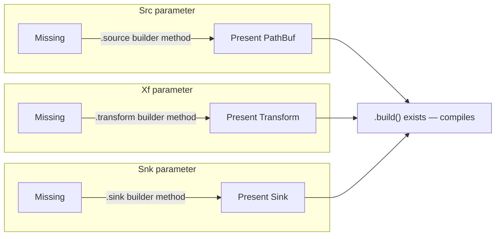

# Typestate pipeline builder

`crates/typestate` builds a pipeline (source → transform → sink) where an
incomplete pipeline fails to *compile*, not to *run*. There's no `unwrap()`
or `Result` check guarding against a missing stage — if you forget one,
`.build()` simply doesn't exist as a method, and rustc tells you so at the
call site.

## Why this instead of a runtime check

A conventional builder might look like this:

```rust,ignore
let pipeline = PipelineBuilder::new()
    .source(path)
    .sink(identity)
    .build()?; // returns Err("no transform set") at runtime
```

That bug — forgetting `.transform(...)` — only surfaces when the code
actually runs, possibly in production, possibly long after the builder was
written. The typestate pattern moves that check to compile time by giving
each required stage its own type parameter:

```rust,ignore
pub struct PipelineBuilder<Src, Xf, Snk> {
    source: Src,
    transform: Xf,
    sink: Snk,
}
```

`Src`, `Xf`, and `Snk` each start as a zero-sized `Missing` marker and
become `Present<T>` once you call the matching builder method. `.build()`
is only defined in the one `impl` block where all three parameters are
`Present<_>`:

```rust,ignore
impl PipelineBuilder<Present<PathBuf>, Present<Transform>, Present<Sink>> {
    pub fn build(self) -> Result<RecordBatch, pipeline::PipelineIoError> { .. }
}
```

Call `.build()` on any other combination and it's a plain "no method named
`build` found" compiler error — the same class of mistake as calling a
method that was never written, because as far as the type system is
concerned, it wasn't.

## Stages can be supplied in any order

Because `source`, `transform`, and `sink` are independent type parameters
(not one combined "pipeline state" enum), calling them in a different order
still narrows the right parameter:

```rust,ignore
PipelineBuilder::new()
    .transform(identity)
    .sink(identity)
    .source(path)   // order doesn't matter — each call narrows its own parameter
    .build()?;
```

## Why independent markers, not one combined state

A typestate builder in Scala often tracks its required stages as one
combined phantom state, narrowed monotonically as each stage is supplied.
Rust has no intersection types to combine three independently-satisfied
constraints into a single type parameter that way, so `PipelineBuilder<Src,
Xf, Snk>` keeps three separate parameters instead, each narrowed only by its
own setter. That isn't a workaround for a missing feature — it composes
better: calling `.source()`, `.transform()`, `.sink()` in any order still
narrows only the one parameter it touches, and `.build()`'s bound (all three
`Present<_>`) is what actually enforces completeness, rather than an enum
encoding one state per possible combination.



Three independent axes, each narrowed by its own setter in any order. `.build()`
is only defined in the corner where all three have reached `Present<_>` — miss
one and that corner of the type space simply has no `build` method.

## From free functions to real closures

The builder's `Transform`/`Sink` types started out as bare
`fn(RecordBatch) -> RecordBatch` pointers — only free functions could serve
as a stage, so a transform needing state from its call site (a captured
column name, say) couldn't be expressed at all. Widening both to
`Box<dyn Fn(RecordBatch) -> RecordBatch>`, and having `.transform()`/`.sink()`
accept `impl Fn(RecordBatch) -> RecordBatch + 'static` generically before
boxing internally, let capturing closures work alongside free functions. The
independence of the three type parameters paid off here too: broadening what
can fill `Xf` didn't require touching `Src` or `Snk` at all.

## Try it

```sh
cargo test -p typestate
```

This runs the happy-path tests plus a `trybuild` suite
(`crates/typestate/tests/compile_fail/`) that asserts `.build()` is a
compile error when any one stage is missing — proof that the guarantee is
real, not just documented.
